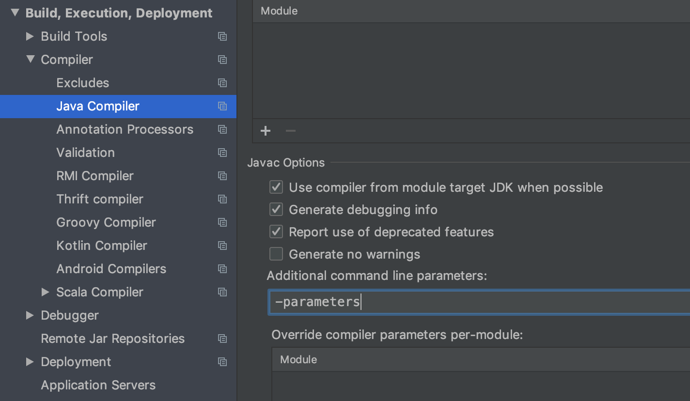

# Armeria examples

- `annotated-http-service`
  - Learn how to write an HTTP service using annotations.
  - See [Annotated services](https://line.github.io/armeria/server-annotated-service.html).

- `grpc-service`
  - Learn how to write a gRPC service with Armeria gRPC module.
  - See [Running a gRPC service](https://line.github.io/armeria/server-grpc.html) and
    [Calling a gRPC service](https://line.github.io/armeria/client-grpc.html).

- `proxy-server`
  - Learn how to make a proxy server which leverages client side load balancing.
  - See [Client-side load balancing](https://line.github.io/armeria/client-service-discovery.html)

- `saml-service-provider`
  - Learn how to authenticate users using SAML.
  - See [SAML Single Sign-on](https://line.github.io/armeria/advanced-saml.html).

- `server-sent-events`
  - Learn how to serve Server-Sent Events.
  - See [Serving Server-Sent Events](https://line.github.io/armeria/server-sse.html).
  
- `spring-boot-minimal`
  - Learn how to use Armeria with the minimal Spring Boot dependencies.

- `spring-boot-tomcat`
  - Learn how to make Armeria serve your Spring Boot web application.

- `spring-boot-webflux`
  - Learn how to make Armeria serve your Spring Boot reactive web application.
  - See [Using Armeria with Spring WebFlux](https://line.github.io/armeria/advanced-spring-webflux-integration.html).

- `static-files`
  - Learn how to serve static files.
  - See [Serving static files](https://line.github.io/armeria/server-http-file.html).

## Configure `-parameters` javac option 

You can omit the value of `@Param` if you compiled your code with `-parameters` javac option. In this case the variable name is used as the value.

```java
public class MyAnnotatedService {
    @Get("/hello/{name}")
    // Use `Param String name` instead of `@Param("name") String name`.
    public HttpResponse hello1(@Param String name) { ... }
}
```

Configure your build tool and IDE to add `-parameters` javac option as follows.

### Gradle

```groovy
tasks.withType(JavaCompile) {
    options.compilerArgs += '-parameters'
}
```

### Maven

```xml
<project>
  <build>
    <plugins>
      <plugin>
        <groupId>org.apache.maven.plugins</groupId>
        <artifactId>maven-compiler-plugin</artifactId>
        <configuration>
          <compilerArgs>
            <arg>-parameters</arg>
          </compilerArgs>
        </configuration>
      </plugin>
    </plugins>
  </build>
</project>
```

### IntelliJ IDEA 
Go to `Preferences` > `Build, Execution, Deployment` > `Compiler` > `Java Compiler` and add `-parameters` to `Additional command line paramters`.
  
<details><summary>Click here to see the screenshot.</summary>
  
</details>

## License

All files under this directory (`examples`) belong to
[the public domain](https://en.wikipedia.org/wiki/Public_domain).
Please feel free to copy-and-paste and start your awesome project with Armeria!
