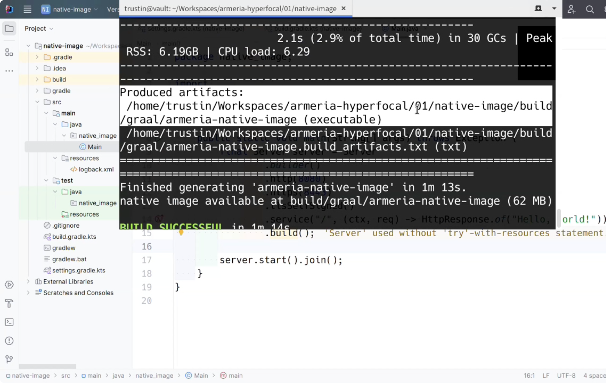
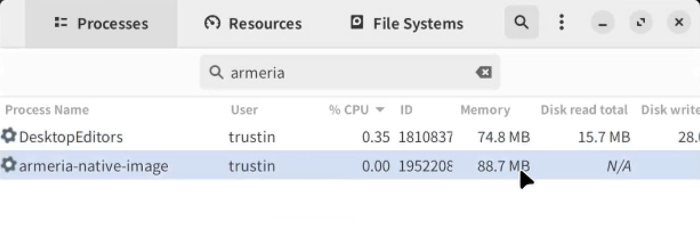
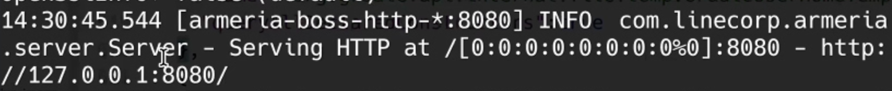
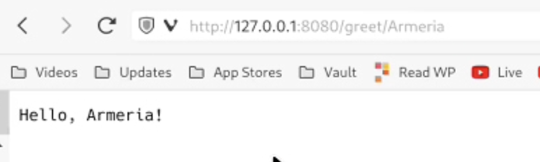

---
authors:
  - meri
tags:
  - hyperfocal
---

# Armeria Hyperfocal #1: Building a Native Image with Aremria and GraalVM

Learn how to build a GraalVM native image for an Armeria server—from a simple Hello World to annotated services.

{/* truncate */}

> **Armeria Hyperfocal** — where everything comes into sharp focus.

Welcome to the very first post of **Armeria Hyperfocal**! In this series, we’re diving into a high-performance topic: **GraalVM Native Image integration**. If you've ever wanted your Java services to start instantly and consume a fraction of the usual memory, this guide is for you.

## 🎯 Topic Overview

In the world of cloud-native microservices, **startup time** and **memory footprint** are critical. Traditional JVM applications can be heavy and slow to warm up.

In this post, we’ll explore how Armeria’s native support for GraalVM allows you to transform your Java bytecode into a standalone executable. We’ll start with a simple "Hello World" and move on to more complex **Annotated Services**, explaining how to handle the common pitfalls of reflection along the way.

Quick start: [https://github.com/line/armeria-hyperfocal/tree/main/01/native-image](https://github.com/line/armeria-hyperfocal/tree/main/01/native-image)

## 💡 Walkthrough

### 1. Setting up the Environment

To get started, we recommend using a Gradle-based project. Since GraalVM requires a specific environment, we use the `foojay.io` toolchain resolver in `settings.gradle.kts` to automatically handle the GraalVM download.

```java
rootProject.name = "native-image"

plugins {
    id("org.gradle.toolchains.foojay-resolver-convention") version "0.6.0"
}
```

In your `build.gradle.kts`, we use a specialized plugin from **Palantir** to streamline the native image build process.

```java
plugins {
    id 'com.palantir.graal' version '0.12.0'
}

java {
    toolchain {
        languageVersion = JavaLanguageVersion.of(17)
        vendor = JvmVendorSpec.matching("GraalVM Community")
    }
}

nativeImage {
    mainClass = 'com.linecorp.armeria.examples.Main'
    executableName = 'armeria-native-image'
    // Optional: Add specific GraalVM flags here
}
```

### 2. A Simple Armeria Server

Before we dive into complex features, let’s see how a basic server is built. Even a simple "Hello World" server can be turned into a native binary.

```java
public final class Main{

    public static void main(String[] args) throws Exception {
        final Server server = Server
                .builder()
                .http(8080)
                .https(8443)
                .tlsSelfSigned()
                .service("/", (ctx, req) -> HttpResponse.of("Hello, world!"))
                .build();

        server.start().join();
    }
}
```

To trigger the native compilation, run:

```bash
$ ./gradlew nativeImage
```

**💡 A Pro-tip for the Build Process:**

When you run this command, GraalVM performs a deep static analysis of your code. You might see a lot of warnings flashing by in your terminal during this stage. Don't panic! This is perfectly normal. GraalVM is simply reporting on code paths it can't fully "see" through. As long as the build finishes and your binary is generated, you can safely ignore these warnings.

### 3. Crafting a Server with Annotated Services

Now, let's try something more "real-world." Armeria’s `AnnotatedService` allows you to define paths using annotations like `@Get` and `@Param`.

```java
public final class Main{

    public static void main(String[] args) throws Exception {
        final Server server = Server
                .builder()
                .http(8080)
                .https(8443)
                .tlsSelfSigned()
                .annotatedService(new Object() {
                    @Get("/greet/:name")
                    public String greet(@Param("name") String name) {
                        return "Hello, " + name + '!';
                    }
                })
                .service("/", (ctx, req) -> HttpResponse.of("Hello, world!"))
                .build();

        server.start().join();
    }
}

// A simple annotated service
public class MyService {
    @Get("/hello/{name}")
    public String hello(@Param("name") String name) {
        return "Hello, " + name + "!";
    }
}
```

**The Catch: Reflection.** This is where it gets interesting. Armeria uses **Java Reflection** to scan these `@Get` and `@Param` annotations at runtime. However, GraalVM’s "tree-shaking" process removes reflection metadata by default to keep the binary small.

If you run an annotated service without extra configuration, it will fail because the server can't "see" your methods. To fix this, we use the **`native-image-agent`**.

1. Run with Agent: Run your JAR once with the agent attached. It watches the JVM and records every reflection call.

```bash
# Run with the agent to record reflection usage
java -agentlib:native-image-agent=config-output-dir=./src/main/resources/META-INF/native-image -jar my-app.jar
```

2. **Include Metadata:** The agent generates a `reflect-config.json`. Place this in `META-INF/native-image/` so GraalVM knows exactly which reflection data to keep during the build.

### 4. The Result: Performance Boost

Once the binary—`armeria-native-image`—is generated, the results are staggering:

| Metric             | Standard JVM | Native Image |
| ------------------ | ------------ | ------------ |
| Startup Time       | ~1–2 seconds | < 100ms      |
| Memory Usage (RSS) | ~250MB+      | ~88MB        |

As you can see, the Native Image starts nearly instantaneously and consumes a fraction of the memory because there is no heavy JVM overhead inside.









## 🧩 Key Takeaways

- **Cloud-Native Ready:** Native images provide the "instant-on" capability required for scale-to-zero architectures.
- **AOT Compilation:** Shifting the heavy lifting to build time creates a highly optimized, standalone executable.
- **Don't Forget the Metadata:** While Armeria comes with built-in metadata support, your specific application logic (like Annotated Services) needs the `native-image-agent` to ensure everything works perfectly in the native binary.

## 🔭 What’s Next

That’s it for this **Hyperfocal**! We hope this guide helps you deploy Armeria services more efficiently. You can find the full source code for this demo in our [GitHub repository](https://github.com/line/armeria-hyperfocal/tree/main/01/native-image).

In the next post, we’ll look at **Log Masking**—showing you how to keep sensitive data out of your logs with ease.

Stay tuned, and keep your focus sharp!
