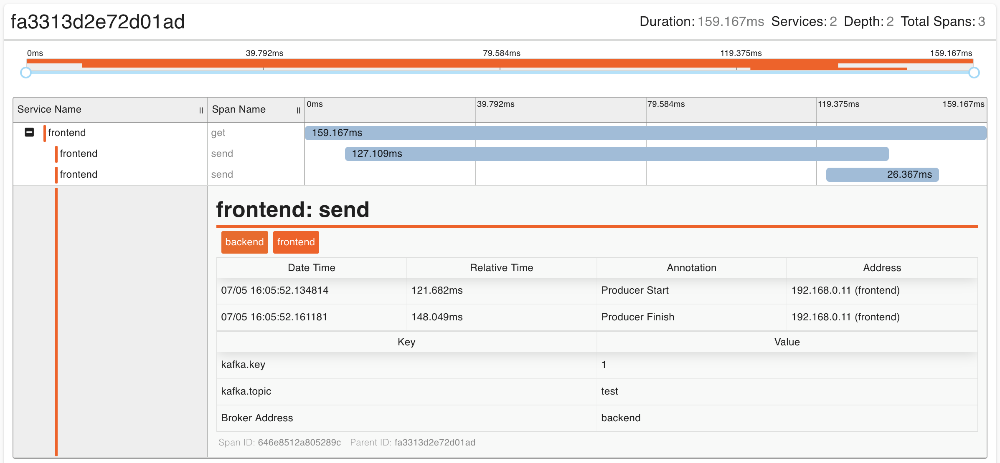

# Zipkin integration

If you want to troubleshoot latency problems in microservice architecture, you will want to use distributed
tracing system such as [Zipkin](https://zipkin.io/). It gathers timing data and shows which component is
failing or taking more time than others in a distributed environment. Armeria supports distributed tracing via
[Brave](https://github.com/openzipkin/brave/), which is a Java tracing library compatible with
[Zipkin](https://zipkin.io/). Let's find out how to use it to trace requests.

First, you need to create the `HttpTracing`:

```java
    import com.linecorp.armeria.common.brave.RequestContextCurrentTraceContext;

    import brave.Tracing;
    import brave.http.HttpTracing;
    import zipkin2.reporter.Reporter;

    Reporter<Span> myReporter = ...
    Tracing tracing = Tracing.newBuilder()
                             .localServiceName("myService")
                             .currentTraceContext(RequestContextCurrentTraceContext.ofDefault())
                             .spanReporter(myReporter)
                             .build();
    HttpTracing httpTracing = HttpTracing.create(tracing);
```

Please note that we specified <type://RequestContextCurrentTraceContext>. It stores the trace context into a
<type://RequestContext> and loads the trace context from the <type://RequestContext> automatically. Because of that,
we don't need to use a thread local variable which can lead to unpredictable behavior in asynchronous
programming. If you want to send timing data to the span collecting server, you should specify `spanReporter`.
For more information about the `spanReporter`, please refer to
[Zipkin reporter](https://github.com/openzipkin/zipkin-reporter-java) or
[the fully working example](https://github.com/openzipkin-contrib/zipkin-armeria-example).

Now, you can specify <type://BraveService> using [Decorating a service](/docs/server-decorator) with the
`HttpTracing` you just built:

```java
    import com.linecorp.armeria.common.HttpResponse;
    import com.linecorp.armeria.server.Server;
    import com.linecorp.armeria.server.brave.BraveService;

    Tracing tracing = ...
    Server server = Server.builder()
                          .http(8081)
                          .service("/", (ctx, res) -> HttpResponse.of(200))
                          .decorator(BraveService.newDecorator(httpTracing))
                          .build();
```

If the requests come to Armeria server and go to another backend, you can trace them using
<type://BraveClient>:

```java
    import com.linecorp.armeria.client.WebClient;
    import com.linecorp.armeria.client.brave.BraveClient;
    import com.linecorp.armeria.server.brave.BraveService;

    Tracing tracing = ...
    WebClient client = WebClient
            .builder("https://myBackend.com")
            .decorator(BraveClient.newDecorator(httpTracing.clientOf("myBackend")))
            .build();

    Server server = Server.builder()
                          .http(8081)
                          .service("/", (ctx, res) -> client.get("/api"))
                          .decorator(BraveService.newDecorator(httpTracing))
                          .build();
```

Please note that our `HttpTracing` instance used the same `Tracing` instance when we
create <type://BraveClient> and <type://BraveService>. Otherwise, there might be problems if the instances are not
configured exactly the same.
In the same manner, you can use the `Tracing` instance with any
[Brave instrumentation libraries](https://github.com/openzipkin/brave/tree/master/instrumentation).
For example, you can use it with [Kafka](https://kafka.apache.org/) producer:

```java
    import org.apache.kafka.clients.producer.KafkaProducer;
    import org.apache.kafka.clients.producer.Producer;
    import org.apache.kafka.clients.producer.ProducerRecord;

    import brave.kafka.clients.KafkaTracing;

    Tracing tracing = ...
    KafkaTracing kafkaTracing = KafkaTracing.newBuilder(tracing)
                                            .remoteServiceName("backend")
                                            .writeB3SingleFormat(true)
                                            .build();

    Properties props = new Properties();
    props.put("bootstrap.servers", "https://myKafka.com");
    props.put("acks", "all");
    ...

    Producer<String, String> kafkaProducer = kafkaTracing.producer(new KafkaProducer<>(props));

    Server server = Server.builder()
                          .http(8081)
                          .service("/", (ctx, req) -> {
                              kafkaProducer.send(new ProducerRecord<>("test", "foo", "bar"));
                              return HttpResponse.of(200);
                          })
                          .decorator(BraveService.newDecorator(tracing))
                          .build();
```

This will trace all the requests sent from the client to the above example server to
[Kafka](https://kafka.apache.org/), and report timing data using the `spanReporter` you specified.
The following screenshot shows a trace of a request:



## See also
- [Armeria Zipkin example](https://github.com/openzipkin-contrib/zipkin-armeria-example)
