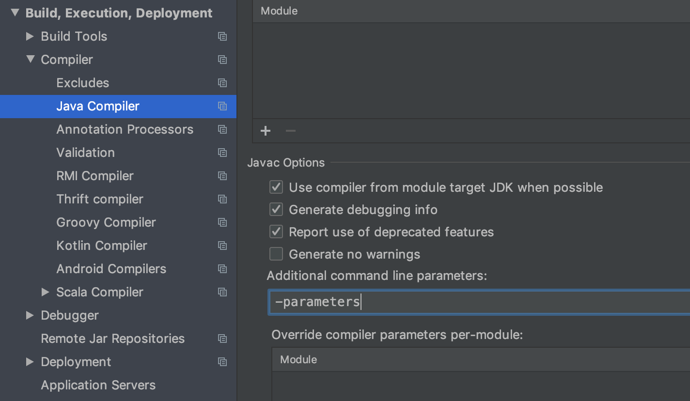

import versions from '../../../gen-src/versions.json';

# Setting up a project

## Requirements

[Java 8 (or later)](https://adoptopenjdk.net/) is required to build and run an application based on Armeria.

<Tip>

Use Java 13 (or later) if you are a contributor who tries to build Armeria itself.
See [CONTRIBUTING.md](https://github.com/line/armeria/blob/master/CONTRIBUTING.md) for more information.
   
</Tip>

## Choosing the artifacts

All Armeria JARs are available in [Maven Central Repository](https://search.maven.org/search?q=g:com.linecorp.armeria%20-shaded)
under group ID `com.linecorp.armeria` so that you can fetch them easily using your favorite build tool.
Add the Armeria artifacts that provide the desired functionality to your project dependencies. The following is
the list of major Armeria artifacts which might interest you:

+---------------------------------------------+---------------------------------------------------------------------------------+
| Artifact ID                                 | Description                                                                     |
+=============================================+=================================================================================+
| `armeria`                                   | The core library.                                                               |
+---------------------------------------------+---------------------------------------------------------------------------------+
| `armeria-brave`                             | Distributed tracing with Brave.                                                 |
|                                             | See [Zipkin integration](/docs/advanced-zipkin).                                |
+---------------------------------------------+---------------------------------------------------------------------------------+
| `armeria-dropwizard2`                       | Provides a Dropwizard 2 Bundle around `armeria-jetty9`.                         |
|                                             | See [Using Armeria with Dropwizard](/docs/advanced-dropwizard-integration).     |
+---------------------------------------------+---------------------------------------------------------------------------------+
| `armeria-eureka`                            | Eureka based service discovery.                                                 |
|                                             | See [Eureka service discovery] and [Eureka service registration].               |
+---------------------------------------------+---------------------------------------------------------------------------------+
| `armeria-grpc`                              | gRPC client and server support.                                                 |
|                                             | See [Running a gRPC service](/docs/server-grpc)                                 |
|                                             | and [Calling a gRPC service](/docs/client-grpc).                                |
+---------------------------------------------+---------------------------------------------------------------------------------+
| `armeria-jetty9`                            | Embedded Jetty 9 Servlet container.                                             |
|                                             |  See [Embedding a servlet container](/docs/server-servlet).                     |
+---------------------------------------------+---------------------------------------------------------------------------------+
| `armeria-kafka`                             | Enables sending access logs to Kafka                                            |
+---------------------------------------------+---------------------------------------------------------------------------------+
| `armeria-kotlin`                            | Kotlin support.                                                                 |
|                                             | See [Kotlin coroutines support].                                                |
+---------------------------------------------+---------------------------------------------------------------------------------+
| `armeria-logback`                           | Provides Logback `Appender` implementation that adds                            |
|                                             | request information.                                                            |
|                                             | See [Logging contextual information](/docs/advanced-logging).                   |
+---------------------------------------------+---------------------------------------------------------------------------------+
| `armeria-retrofit2`                         | Allows using Armeria instead of OkHttp as transport layer                       |
|                                             | when using Retrofit2.                                                           |
|                                             | See [Retrofit integration](/docs/client-retrofit).                              |
+---------------------------------------------+---------------------------------------------------------------------------------+
| `armeria-rxjava3`                           | RxJava 3 plugin                                                                 |
+---------------------------------------------+---------------------------------------------------------------------------------+
| `armeria-saml`                              | SAML support                                                                    |
+---------------------------------------------+---------------------------------------------------------------------------------+
| `armeria-spring-boot2-autoconfigure`        | Spring Boot 2 integration                                                       |
+---------------------------------------------+---------------------------------------------------------------------------------+
| `armeria-spring-boot2-webflux-autoconfigure`| Spring Boot 2 WebFlux integration. See                                          |
|                                             | [Using Armeria with Spring WebFlux](/docs/advanced-spring-webflux-integration). |
+---------------------------------------------+---------------------------------------------------------------------------------+
| `armeria-thrift0.13`                        | Thrift 0.13 client and server support.                                          |
|                                             | See [Running a Thrift service](/docs/server-thrift)                             |
|                                             | and [Calling a Thrift service](/docs/client-thrift).                            |
+---------------------------------------------+---------------------------------------------------------------------------------+
| `armeria-tomcat9`                           | Embedded Tomcat 9 Servlet container.                                            |
|                                             |  See [Embedding a servlet container](/docs/server-servlet).                     |
+---------------------------------------------+---------------------------------------------------------------------------------+
| `armeria-zookeeper3`                        | ZooKeeper 3 based service discovery.                                            |
|                                             | See [ZooKeeper service discovery] and [ZooKeeper service registration].         |
+---------------------------------------------+---------------------------------------------------------------------------------+

[Kotlin coroutines support]: /docs/server-annotated-service#kotlin-coroutines-support
[ZooKeeper service discovery]: /docs/client-service-discovery#zookeeper-based-service-discovery-with-zookeeperendpointgroup
[ZooKeeper service registration]: /docs/server-service-registration#zookeeper-based-service-registration-with-zookeeperupdatinglistener
[Eureka service discovery]: /docs/client-service-discovery#eureka-based-service-discovery-with-eurekaendpointgroup
[Eureka service registration]: /docs/server-service-registration#eureka-based-service-registration-with-eurekaupdatinglistener

## Setting up with a build system

You might want to use the following build file as a starting point when you set up a new project:

<Tabs>
  <TabPane tab="Gradle" key="gradle">
    <CodeBlock language="groovy" filename="build.gradle">{`
    apply plugin: 'java'
    apply plugin: 'idea'
    apply plugin: 'eclipse'\n
    repositories {
        mavenCentral()
    }\n
    dependencies {
        // Adjust the list as you need.
        ['armeria',
        'armeria-brave',
        'armeria-grpc',
        'armeria-jetty9',
        'armeria-kafka',
        'armeria-logback',
        'armeria-retrofit2',
        'armeria-rxjava3',
        'armeria-saml',
        'armeria-thrift0.13',
        'armeria-tomcat9',
        'armeria-zookeeper3'].each {
            implementation "com.linecorp.armeria:\${it}:${versions['com.linecorp.armeria:armeria-bom']}"
        }\n
        // Logging
        runtimeOnly 'ch.qos.logback:logback-classic:${versions['ch.qos.logback:logback-classic']}'
        runtimeOnly 'org.slf4j:log4j-over-slf4j:${versions['org.slf4j:log4j-over-slf4j']}'
    }
    `}</CodeBlock>
  </TabPane>
  <TabPane tab="Maven" key="maven">
    <CodeBlock language="xml" filename="pom.xml">{`
    <project xmlns="http://maven.apache.org/POM/4.0.0"
             xmlns:xsi="http://www.w3.org/2001/XMLSchema-instance"
             xsi:schemaLocation="http://maven.apache.org/POM/4.0.0 http://maven.apache.org/xsd/maven-4.0.0.xsd">\n
      <modelVersion>4.0.0</modelVersion>
      <groupId>com.example</groupId>
      <artifactId>myproject</artifactId>
      <version>1.0-SNAPSHOT</version>
      <packaging>jar</packaging>
      <name>myproject</name>
      <url>https://example.com/</url>\n
      <properties>
        <project.build.sourceEncoding>UTF-8</project.build.sourceEncoding>
      </properties>\n
      <dependencies>
        <dependency>
          <groupId>com.linecorp.armeria</groupId>
          <artifactId>armeria</artifactId>
          <version>${versions['com.linecorp.armeria:armeria-bom']}</version>
        </dependency>
        <dependency>
          <groupId>com.linecorp.armeria</groupId>
          <artifactId>armeria-brave</artifactId>
          <version>${versions['com.linecorp.armeria:armeria-bom']}</version>
        </dependency>
        <dependency>
          <groupId>com.linecorp.armeria</groupId>
          <artifactId>armeria-grpc</artifactId>
          <version>${versions['com.linecorp.armeria:armeria-bom']}</version>
        </dependency>
        <dependency>
          <groupId>com.linecorp.armeria</groupId>
          <artifactId>armeria-jetty9</artifactId>
          <version>${versions['com.linecorp.armeria:armeria-bom']}</version>
        </dependency>
        <dependency>
          <groupId>com.linecorp.armeria</groupId>
          <artifactId>armeria-kafka</artifactId>
          <version>${versions['com.linecorp.armeria:armeria-bom']}</version>
        </dependency>
        <dependency>
          <groupId>com.linecorp.armeria</groupId>
          <artifactId>armeria-logback</artifactId>
          <version>${versions['com.linecorp.armeria:armeria-bom']}</version>
        </dependency>
        <dependency>
          <groupId>com.linecorp.armeria</groupId>
          <artifactId>armeria-retrofit2</artifactId>
          <version>${versions['com.linecorp.armeria:armeria-bom']}</version>
        </dependency>
        <dependency>
          <groupId>com.linecorp.armeria</groupId>
          <artifactId>armeria-rxjava3</artifactId>
          <version>${versions['com.linecorp.armeria:armeria-bom']}</version>
        </dependency>
        <dependency>
          <groupId>com.linecorp.armeria</groupId>
          <artifactId>armeria-saml</artifactId>
          <version>${versions['com.linecorp.armeria:armeria-bom']}</version>
        </dependency>
        <dependency>
          <groupId>com.linecorp.armeria</groupId>
          <artifactId>armeria-thrift0.13</artifactId>
          <version>${versions['com.linecorp.armeria:armeria-bom']}</version>
        </dependency>
        <dependency>
          <groupId>com.linecorp.armeria</groupId>
          <artifactId>armeria-tomcat9</artifactId>
          <version>${versions['com.linecorp.armeria:armeria-bom']}</version>
        </dependency>
        <dependency>
          <groupId>com.linecorp.armeria</groupId>
          <artifactId>armeria-zookeeper3</artifactId>
          <version>${versions['com.linecorp.armeria:armeria-bom']}</version>
        </dependency>
        <!-- Logging -->
        <dependency>
          <groupId>ch.qos.logback</groupId>
          <artifactId>logback-classic</artifactId>
          <version>${versions['ch.qos.logback:logback-classic']}</version>
          <scope>runtime</scope>
        </dependency>
        <dependency>
          <groupId>org.slf4j</groupId>
          <artifactId>log4j-over-slf4j</artifactId>
          <version>${versions['org.slf4j:log4j-over-slf4j']}</version>
          <scope>runtime</scope>
        </dependency>
      </dependencies>
    </project>
    `}</CodeBlock>
  </TabPane>
</Tabs>

## Configure `-parameters` javac option

You can configure your build tool to add `-parameters` javac option as follows.

<Tabs>
  <TabPane tab="Gradle" key="gradle">
    <CodeBlock language="groovy" filename="build.gradle">{`
    tasks.withType(JavaCompile) {
        options.compilerArgs += '-parameters'
    }
    `}</CodeBlock>
  </TabPane>
  <TabPane tab="Maven" key="maven">
    <CodeBlock language="xml" filename="pom.xml">{`
    <project>
      <build>
        <plugins>
          <plugin>
            <groupId>org.apache.maven.plugins</groupId>
            <artifactId>maven-compiler-plugin</artifactId>
            <configuration>
              <compilerArgs>
                <arg>-parameters</arg>
              </compilerArgs>
            </configuration>
          </plugin>
        </plugins>
      </build>
    </project>
    `}</CodeBlock>
  </TabPane>
</Tabs>

### IntelliJ IDEA

Go to `Preferences` > `Build, Execution, Deployment` > `Compiler` > `Java Compiler` 
and add `-parameters` to `Additional command line parameters`.

## Using Maven BOM for simpler dependency management

You can import `com.linecorp.armeria:armeria-bom` into your build rather than specifying Armeria versions in
more than one place. See [this article](https://docs.gradle.org/current/userguide/platforms.html#sub:bom_import)
for Gradle and [this article](https://www.baeldung.com/spring-maven-bom) for Maven to learn more about what
Maven BOM is and how to use it.
