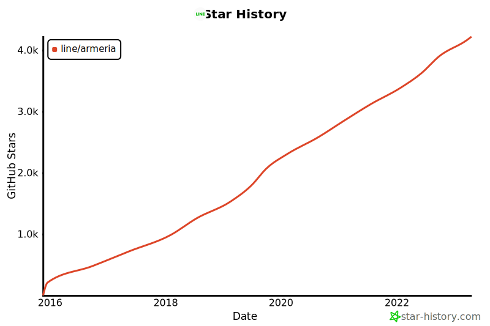

# Armeria Newsletter vol. 5

<video class="hideOnReducedMotion" src="../../images/armeria.m4v" preload="none" autoplay muted loop style="width: 282px; height: 112px;">
  
</video>

## Announcements

We have some announcements to share with you.

- 📢 **Discontinuation of virtual office hours**:
  - We will transform the existing virtual hours to another form such as quarterly webinar. But we haven't decided how often we hold the webinar or what to cover. Please stay tuned.
- 🙌 **[Armeria adopters page](https://github.com/line/armeria/discussions/4626) and limited goods package**:
  - You can now show off how well your service takes advantage of Armeria!
  - Don't forget to request the limited goods packages.

- 🚛 **Moving to Discord**:
  - We decided to move to Discord to preserve all past messages.
  - But no rush! We'll run the both Slack and Discord for a while. Please join [our Discord server](/s/discord) whenever you're ready.
- 🌟 **We're now 4K family members!**
  - It's amazing to see the steady growth of stars. Thank y'all!

## From the devs

- ✨ We've released several new versions since our last newsletter with a bunch of new exciting features! Here are the highlights between [1.17.1](/release-notes/1.17.1) and [1.23.1](/release-notes/1.23.1).
  - Resilience4j circuit breaker support
  - Improvements in gRPC support
    - Asynchronous ServerInterceptor + Kotlin Coroutine support
    - Improved annotations support
    - Improvements in gRPC HTTP/JSON transcoding
  - Spring Boot 3 support (and dropping Spring Boot 1)
  - Improvements in DocService
    - Markdown and Mermaid support for DocService
    - Autocompletion support for gRPC and Thrift

      <video class="hideOnReducedMotion" src="../../images/docservice-autocomplete.m4v" preload="none" autoplay muted controls loop />

## From the community

- 🎓 Try out this [guided tutorial for gRPC Service](/tutorials/grpc/blog)! This super friendly and simple tutorial will guide you to make a blog service just like [the previous tutorial for REST services](/tutorials/rest/blog). But this time, you'll try step by step guide including:
  - Implement Armeria gRPC service and client
  - Exception handling
  - Invoke gRPC service via DocService
- 🔋 Here are some cool open source projects powered by Armeria:
  - [Thorium Framework](https://github.com/line/armeria/discussions/4626#discussioncomment-4668166)
    - A Scala 3 microservice framework leveraging on Armeria
  - [Apache SkyWalking](https://github.com/line/armeria/discussions/4626#discussioncomment-4863434)
    - An application performance monitor tool for distributed systems built on top of Armeria
  - [Scavenger](https://github.com/naver/scavenger)
    - A runtime dead code analysis tool on top of Armeria

## We need your comments

- 🤔 Your opinion means a lot to us. Please let us know what you think about these proposals:
  - #4314 Provide an easier way to get a <type://ClientRequestContext>
  - #4569 Consider RFC 7807 Problem Details for HTTP APIs as the default response format in REST APIs
  - #4738 Consider a way to make <type://OAuth2AuthorizationGrant> dynamic when update the grant information needed

## Good first issues

- 🔰 Want to contribute but not sure where to start from? Try this issue:
  - #4797 Contain which file doesn't exist in the response so that user get more clues to distinguish if the file service isn't bound at all or only the file doesn't exist

## Stay tuned

Sign up for our newsletters to keep up-to-date with new releases and useful tips!

  <Mailchimp />

## Thank you!

<ThankYou
  message={() => 
Since our last newsletter, we received awesome contributions from the following contributors:
}
  usernames={[
    'Bogyie',
    'Bue-von-hon',
    'DasAmpharos',
    'Dogacel',
    'Jimexist',
    'KarboniteKream',
    'Lincong',
    'SeanWhoCodes',
    'Yuri999',
    'anuraaga',
    'chanho0912',
    'chris-ryan-square',
    'chungonn',
    'cj848',
    'cnabro',
    'cormoran',
    'daniel-itunu',
    'davin111',
    'devdynam0507',
    'di-seo',
    'dinujoh',
    'dlvenable',
    'doljae',
    'echo304',
    'freevie',
    'ghkim3221',
    'heesuk-ahn',
    'heowc',
    'hirakida',
    'hllee1021',
    'hyperxpro',
    'ikhoon',
    'injae-kim',
    'jrhee17',
    'kezhenxu94',
    'klurpicolo',
    'kojilin',
    'ks-yim',
    'mauhiz',
    'minwoox',
    'mitrofmep',
    'mscheong01',
    'nao0811ta',
    'natsumehu',
    'ngyukman',
    'opus53',
    'policeman-kh',
    'proceane',
    'resquivel-squareup',
    'rhodo',
    'seonwoo960000',
    'sullis',
    'ta7uw',
    'takezoe',
    'taodo2291',
    'tawAsh1',
    'tobias-',
    'tomatophobia',
    'trustin',
    'vkostyukov',
    'wu-sheng',
    'yamamichid'
  ]}
/>
