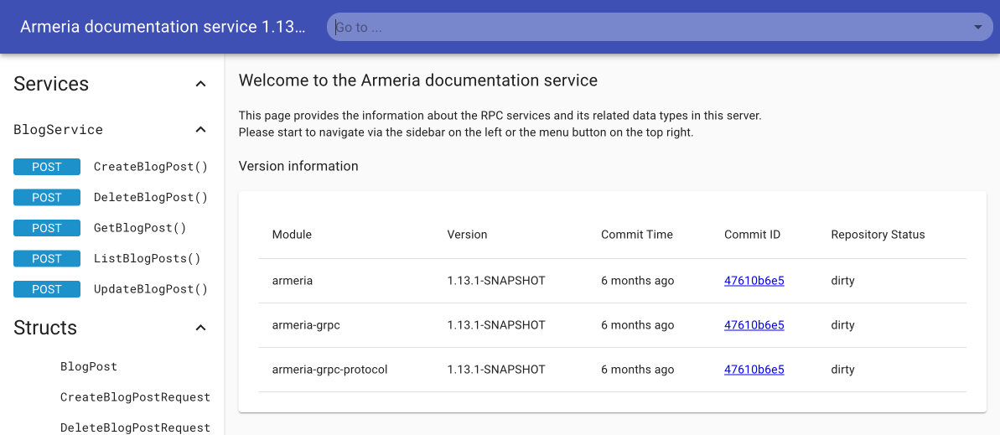
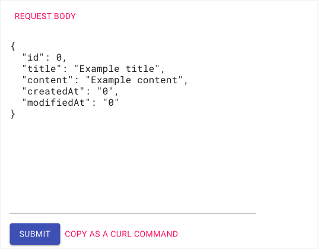
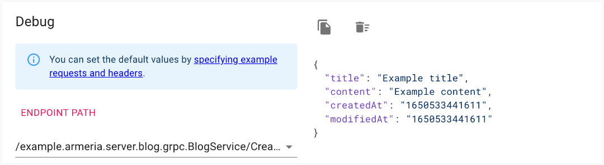

# Adding Documentation service 

Take advantage of Armeria's [Documentation service](/docs/server-docservice) which automatically creates documentation of your service methods, as well as providing means to test out the methods. Note that the Documentation service supports only unary calls for testing. To make calls on the Documentation service, you need to enable unframed requests.

<TutorialSteps current={7} />

## What you need

You need to have all the files you created for the server-side. No client files are required for this step.

- [Java code generated](/tutorials/grpc/blog/define-service#compile-proto-file)
- Main.java
- BlogService.java
- GrpcExceptionHandler.java
- BlogNotFoundException.java

## 1. Create a DocService instance

Create a <type://DocService> instance in `Main.java`.

```java filename=Main.java
import com.linecorp.armeria.server.docs.DocService;
import com.linecorp.armeria.server.docs.DocServiceFilter;
import io.grpc.reflection.v1alpha.ServerReflectionGrpc;

final class Main {
  private static Server newServer(int port) throws Exception {
    final BlogPost exampleRequest = 
      BlogPost.newBuilder()
              .setTitle("Example title")
              .setContent("Example content")
              .build();
                                            
    final DocService docService = 
      DocService.builder()
                .exampleRequests(BlogServiceGrpc.SERVICE_NAME,
                                 "CreateBlogPost", exampleRequest)
                .exclude(DocServiceFilter.ofServiceName(
                         ServerReflectionGrpc.SERVICE_NAME))
                .build();
                    
  }
}
```

## 2. Enable unframed requests
To test making calls on the Documentation service, enable unframed requests by setting <type://GrpcServiceBuilder#enableUnframedRequests(boolean)> to `true`. This makes the blog service support requests that are not framed in gRPC wire format. For us, this enables making calls from a web browser.

```java filename=Main.java
private static Server newServer(int port) throws Exception {
  final GrpcService grpcService =
          GrpcService.builder()
                     .addService(new BlogService())
                     .enableUnframedRequests(true)
                     .exceptionMapping(new GrpcExceptionHandler())
                     .useBlockingTaskExecutor(true)
                     .build();
```


## 3. Add the Documentation service

Add the doc service to the server builder.

```java filename=Main.java
final class Main {
  private static Server newServer(int port) throws Exception {
    return Server.builder()
                 .http(port)
                 .service(grpcService)
                 .serviceUnder("/docs", docService) // add this
                 .build();
    }
}
```

Now, re-run the server. The server and services are launched successfully if you see this message.

```bash
 Server has been started. Serving DocService at http://127.0.0.1:8080/docs
```

## 4. Test DocService

Let's test and call our service operations using Armeria's Documentation service.

1. Click the URL `http://127.0.0.1:8080/docs` from the log message or open up the URL on a web browser. If you see the Document service page, you've successfully launched the <type://DocService> and server.



2. Click the **CreateBlogPost()** method link in the left panel. You can make calls to the method from the page.

  
  
  Note that in the **REQUEST BODY** section the values specified in the `exampleRequest` are automatically displayed on the page.
  
  ```java filename=Main.java
  final BlogPost exampleRequest = BlogPost.newBuilder()
                                          .setTitle("Example title")
                                          .setContent("Example content")
                                          .build();
  ```

3. Click the **SUBMIT** button, and you'll see the blog post information returned in the right panel.



## Next step

Here, we've finally added the Documentation service to the server. We've come to the end of this tutorial. Next, try adding more service methods to the tutorial or have a go at developing a service of your own.

<TutorialSteps current={7} />
