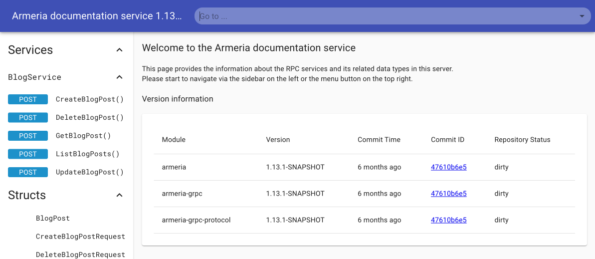
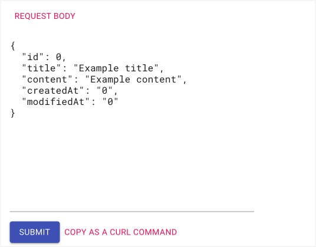

# Implementing DELETE operation

So far, we created, read, and updated a blog post.
Now, let's implement and make a call to delete a blog post.
Also, we'll add Armeria's [Documentation Service](/docs/server-docservice) for testing our blog service.

<TutorialSteps current={6} />

## What you need

You need to have the following files obtained from previous steps.
You can always [download](https://github.com/line/armeria-examples/tree/main/tutorials/grpc) the full version, instead of creating one yourself.

- [Generated Java code](/tutorials/grpc/blog/define-service#6-compile-the-proto-file)
- `BlogService.java`
- `Main.java`
- `BlogServiceTest.java`
- `BlogNotFoundException.java`
- `GrpcExceptionHandler.java`

## 1. Implement server-side

Let's implement a service method `deleteBlogPost()` in the `BlogService` class.

1. Add a service method, `deleteBlogPost()`.

  ```java filename=BlogService.java
  import example.armeria.blog.grpc.DeleteBlogPostRequest;

  public class BlogService extends BlogServiceGrpc.BlogServiceImplBase {
    @Override
    public void deleteBlogPost(DeleteBlogPostRequest request, StreamObserver<Empty> responseObserver) {
      try {
        // Simulate a blocking API call.
        Thread.sleep(100);
      } catch (InterruptedException e) {
        throw new RuntimeException(e);
      }

      final BlogPost removed = blogPosts.remove(request.getId());
      if (removed == null) {
        responseObserver.onError(
          new BlogNotFoundException("The blog post does not exist. ID: " + request.getId()));
      } else {
          responseObserver.onNext(Empty.getDefaultInstance());
          responseObserver.onCompleted();
      }
   }
  }
  ```
2. Add Armeria's <type://GrpcServiceBuilder>'s blocking task executor to make all gRPC methods executed
  in the blocking task executor's thread pool.

  By default, service methods are executed on the event loop and are expected to be implemented asynchronously.
  To implement blocking logic, call `useBlockingTaskExecutor(true)`.

  ```java filename=Main.java
  private static Server newServer(int port) throws Exception {
    final GrpcService grpcService =
            GrpcService.builder().addService(new BlogService())
                                 .exceptionMapping(new GrpcExceptionHandler())
                                 .useBlockingTaskExecutor(true) // Add this
                                 .build();
    ...
  }
  ```

## 2. Test deleting a blog post

Let's test deleting a blog post.
We'll delete the blog post with ID `1`, and try retrieving with the same ID to verify it is indeed deleted.
Add a test method like the following.

```java filename=BlogServiceTest.java
@Test
@Order(7)
void deleteBlogPost() {
  final DeleteBlogPostRequest request = DeleteBlogPostRequest.newBuilder()
                                                             .setId(1)
                                                             .build();
  client.deleteBlogPost(request);
  final Throwable exception = catchThrowable(() -> {
    client.getBlogPost(GetBlogPostRequest.newBuilder().setId(1).build());
  });

  final StatusRuntimeException statusException = (StatusRuntimeException) exception;
  assertThat(statusException.getStatus().getCode()).isEqualTo(Code.NOT_FOUND);
  assertThat(statusException)
          .hasMessageContaining("The blog post does not exist. ID: 1");
}
```

Run all the test cases on your IDE or using Gradle.
Check that you see the test is passed.

## 3. Test an error case

Let's test deleting a blog post that does not exist.
Add a test method like the following.

```java filename=BlogServiceTest.java
@Test
@Order(8)
void badRequestExceptionHandlerWhenTryingDeleteMissingBlogPost() throws JsonProcessingException {
  final Throwable exception = catchThrowable(() -> {
    client.deleteBlogPost(DeleteBlogPostRequest.newBuilder().setId(100).build());
  });
  final StatusRuntimeException statusException = (StatusRuntimeException) exception;
  assertThat(statusException.getStatus().getCode()).isEqualTo(Code.NOT_FOUND);
  assertThat(statusException)
          .hasMessageContaining("The blog post does not exist. ID: 100");
}
```

Run all the test cases on your IDE or using Gradle.
Check that you see the test is passed.

## 4. Add the Documentation service

This time, we'll add Armeria's [Documentation service](/docs/server-docservice).
The Documentation service automatically creates documentation of your service methods, as well as providing means to test out the methods.

1. In the `newServer()` method, add a <type://DocService> instance and a request example for [creating blog posts](/tutorials/grpc/blog/implement-create),
  using <type://DocServiceBuilder#exampleRequests(Class,String,Iterable)>. Feel free to add more examples for other service methods.
  ```java filename=Main.java
  import com.linecorp.armeria.server.docs.DocService;
  import com.linecorp.armeria.server.docs.DocServiceFilter;
  import io.grpc.reflection.v1alpha.ServerReflectionGrpc;

  final class Main {
    private static Server newServer(int port) throws Exception {
      final BlogPost exampleRequest =
        BlogPost.newBuilder()
                .setTitle("Example title")
                .setContent("Example content")
                .build();
      final DocService docService =
        DocService.builder()
                  .exampleRequests(BlogServiceGrpc.SERVICE_NAME,
                                   "CreateBlogPost", exampleRequest)
                  .exclude(DocServiceFilter.ofServiceName(
                           ServerReflectionGrpc.SERVICE_NAME))
                  .build();

    }
  }
  ```
2. Enable unframed requests by setting <type://GrpcServiceBuilder#enableUnframedRequests(boolean)> to `true`.
  This makes the blog service support requests that are not framed in gRPC wire format.
  For us, this enables making calls from a web browser.
  ```java filename=Main.java
  private static Server newServer(int port) throws Exception {
  ...
  final GrpcService grpcService =
          GrpcService.builder()
                     .addService(new BlogService())
                     .enableUnframedRequests(true) // Add this
                     .exceptionMapping(new GrpcExceptionHandler())
                     .useBlockingTaskExecutor(true)
                     .build();
  ...
  }
  ```
3. Add the <type://DocService> to the server builder.
  ```java filename=Main.java
  private static Server newServer(int port) throws Exception {
    ...
    return Server.builder()
                 .http(port)
                 .service(grpcService)
                 .serviceUnder("/docs", docService) // Add this
                 .build();
  }
  ```
4. (Optional) To access the Documentation service result easily, edit the log message in the `main()` method.
  ```java filename=Main.java highlight=2
  public static void main(String[] args) throws Exception {
    ...
    logger.info("Server has been started. Serving DocService at http://127.0.0.1:{}/docs",
                server.activeLocalPort());
  }
  ```
5. Otherwise, restart the server by running the `Main.main()` method.

  The server and services are launched successfully if you see this message.
  ```bash
  Server has been started. Serving DocService at http://127.0.0.1:8080/docs
  ```

## 5. Check the DocService page

Let's test and call our service operations using Armeria's Documentation service.

1. Click the URL http://127.0.0.1:8080/docs from the log message or open up the URL on a web browser.

  If you see the Document service page, you've successfully launched the <type://DocService> and server.

  

2. Click the **CreateBlogPost()** method link in the left panel. You can make calls to the method from the page.

  

  Note that in the **REQUEST BODY** section the values specified in the `exampleRequest` are automatically displayed on the page.

  ```java filename=Main.java
  final BlogPost exampleRequest = BlogPost.newBuilder()
                     .setTitle("Example title")
                     .setContent("Example content")
                     .build();
  ```

3. Click the **SUBMIT** button, and you'll see the blog post information returned in the right panel.

  

## What's next

In this step, we've implemented a service method and client method for deleting a blog post.
We've also added [Documentation service](/docs/server-docservice) to our server.

We've come to the end of this tutorial.
Next, try adding more service methods to the tutorial or have a go at developing a service of your own.

<TutorialSteps current={6} />
