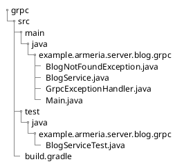

import versions from '/gen-src/versions.json';

# gRPC tutorial introduction

Through this tutorial, you'll learn to build a gRPC service with Armeria.

In particular, you'll be using these Armeria features:

// TW question: 뭐가 있을까요?
- Interceptor...?
- DecorateModel?

This tutorial is based on a [sample service](https://github.com/line/armeria-examples/tree/master/tutorials/grpc), a minimal blog service, with which you can create, read, update, and delete blog posts.
To keep our focus on Armeria, this tutorial and the sample service use memory-based operations instead of database operations.

[Try writing a service yourself](#try-writing-blog-service-yourself) by following this tutorial or have a go at [running the sample service](#build-and-run-sample-service) right away.

## Assumptions

This tutorial assumes that you have:

- Experience in building services in Java
- Experience in Java frameworks for server-side programming
- Understanding of gRPC and how to implement them

## Prerequisites

To run and develop the sample service, set your computer with the requirements:

- JDK 11 or higher
- Gradle: Set your Gradle to compile Java with the [-parameters](/docs/setup/#configure--parameters-javac-option) option

## Sample service

The sample service provides you implementations of CRUD operations with corresponding service methods.

| Operation | Method |
| -- | -- | -- |
| Create | `CreateBlogPost()` |
| Read | `GetBlostPost()`, `ListBlogPosts()` |
| Update | `UpdateBlogPost()` |
| Delete | `DeleteBlogPost()` |

### Sample service structure

The [sample service code](https://github.com/line/armeria-examples/tree/master/tutorials/grpc) consists of the following folders and files.



### build.gradle

Here is a part of the build.gradle file for the sample service. If you are trying the tutorial from scratch, base your file on the sample service's.

// TW question: Do we need to change anything here for gRPC?

<CodeBlock language="groovy" filename="build.gradle">{`
  apply plugin: 'java'
  apply plugin: 'idea'
  apply plugin: 'eclipse'\n
  repositories {
      mavenCentral()
  }\n
  dependencies {
      implementation "com.linecorp.armeria:armeria:${versions['com.linecorp.armeria:armeria-bom']}"\n
      // Logging
      runtimeOnly 'ch.qos.logback:logback-classic:${versions['ch.qos.logback:logback-classic']}'
      runtimeOnly 'org.slf4j:log4j-over-slf4j:${versions['org.slf4j:log4j-over-slf4j']}'
  }
`}</CodeBlock>

## Build and run sample service

Have a go at running the sample gRPC service and see the outcome of this tutorial.
Using Armeria's [Documentation Service](/docs/server-docservice), you can see a server running, receiving requests and sending responses.

1. Download the code from [here](https://github.com/line/armeria-examples/tree/master/tutorials/grpc).

// TW question: do we need to compile proto first? Or will the following command do it for us?

2. Build the sample service using the Gradle Wrapper.
  ```bash
  $ ./gradlew build
  ```
3. Run the sample service again, using the Gradle Wrapper.
  ```bash
  $ ./gradlew run
  ```
4. Open the Documentation service page on your web browser at http://127.0.0.1:8080/docs.

## Try writing blog service yourself

Try writing the blog service yourself by following the guides in the given order:

1. [Defining a service](/tutorials/grpc/blog/define-service)
2. [Implementing a gRPC service](/tutorials/grpc/blog/implement-grpc-server)
3. [Adding a service to server](/tutorials/grpc/blog/add-service-to-server)
4. [Developing a gRPC client](/tutorials/grpc/blog/develop-grpc-client)
