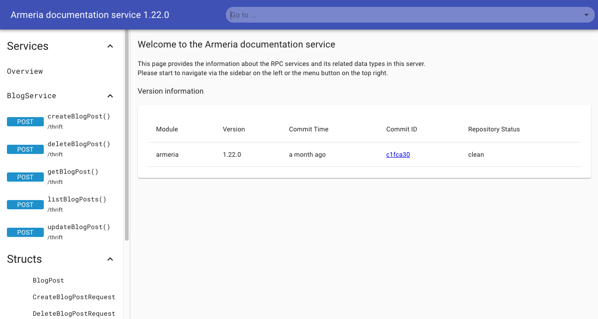

# Implementing DELETE operation

So far, we created, read, and updated a blog post.
Now, let's implement and make a call to delete a blog post.
Also, we'll add Armeria's [Documentation Service](/docs/server-docservice) for testing our blog service.

<TutorialSteps current={7} />

## What you need

You need to have the following obtained from previous steps:

- [Generated Java code](/tutorials/thrift/blog/create-service#2-compile-the-thrift-file)
- `Main.java`
- `BlogServiceImpl.java`
- `BlogServiceExceptionHandler.java`
- `BlogClient.java`
- `BlogServiceTest.java`

## 1. Implement server-side

In the `BlogServiceImpl` class, implement the `deleteBlogPost()` method to delete a blog post.
Let's throw an exception in case there is no blog post for the given ID.

```java filename=BlogServiceImpl.java
@Override
public void deleteBlogPost(DeleteBlogPostRequest request, AsyncMethodCallback<Void> resultHandler)
      throws TException {
  final BlogPost removed = blogPosts.remove(request.getId());
  if (removed == null) {
    resultHandler.onError(
            new IllegalArgumentException("The blog post does not exist. ID: " + request.getId()));
  } else {
    resultHandler.onComplete(null);
  }
}
```

## 2. Implement client-side

In the `BlogClient` class, add the `deleteBlogPost()` method to send a request deleting a blog post.

```java filename=BlogClient.java
import example.armeria.blog.thrift.DeleteBlogPostRequest;
...
void deleteBlogPost(int id) throws TException {
  final DeleteBlogPostRequest request = new DeleteBlogPostRequest().setId(id);
  blogService.deleteBlogPost(request);
}
```

## 3. Test deleting a blog post

Let's test deleting a blog post.
We'll delete the blog post with ID `1`, and try retrieving with the same ID to verify it is indeed deleted.
Add a test method like the following.

```java filename=BlogServiceTest.java
@Test
@Order(7)
void deleteBlogPost() throws TException {
  final BlogClient client = new BlogClient(server.httpUri(), "/thrift");
  client.deleteBlogPost(1);
  final Throwable exception = catchThrowable(() -> {
    client.getBlogPost(1);
  });
  assertThat(exception)
    .isInstanceOf(BlogNotFoundException.class)
    .extracting("reason")
    .asString();
}
```

Run all the test cases on your IDE or using Gradle.
Check that you see the test is passed.

## 4. Test an error case

Let's test deleting a blog post that does not exist.
Add a test method like the following.

```java filename=BlogServiceTest.java
@Test
@Order(8)
void deleteInvalidBlogPost() {
  final BlogClient client = new BlogClient(server.httpUri(), "/thrift");
  final Throwable exception = catchThrowable(() -> {
    client.deleteBlogPost(100);
  });
  assertThat(exception)
    .isInstanceOf(BlogNotFoundException.class)
    .extracting("reason")
    .asString()
    .isEqualTo("The blog post does not exist. ID: 100");
}
```

Run all the test cases on your IDE or using Gradle.
Check that you see the test is passed.

## 5. Add the Documentation service

This time, we'll add Armeria's [Documentation service](/docs/server-docservice).
The Documentation service automatically creates documentation of your service methods, as well as providing means to test out the methods.

1. In the `newServer()` method, add a <type://DocService> and a request example for [creating blog posts](/tutorials/thrift/blog/implement-create),
  using <type://DocServiceBuilder#exampleRequests(Class,String,Iterable)>. Feel free to add more examples for other service methods.
  ```java filename=Main.java
  import com.linecorp.armeria.server.docs.DocService;
  import example.armeria.blog.thrift.CreateBlogPostRequest;
  ...
  private static Server newServer(int port) throws Exception {
    ...
    final CreateBlogPostRequest exampleRequest = new CreateBlogPostRequest()
            .setTitle("Example title")
            .setContent("Example content");
    final DocService docService = DocService
            .builder()
            .exampleRequests(List.of(new BlogService.createBlogPost_args(exampleRequest)))
            .build();
    ...
  }
  ```
2. In the `newServer()` method, add the <type://DocService> to our server builder.
  ```java filename=Main.java highlight=5
  private static Server newServer(int port) throws Exception {
    ...
    return Server.builder()
             .http(port)
             .service("/thrift", tHttpService)
             // You can access the documentation service at http://127.0.0.1:8080/docs.
             // See https://armeria.dev/docs/server-docservice for more information.
             .serviceUnder("/docs", docService)
             .build();
  }
  ```

3. (Optional) To access the Documentation service result easily, edit the log message in the `main()` method.
  ```java filename=Main.java highlight=2
  public static void main(String[] args) throws Exception {
    ...
    logger.info("Server has been started. Serving DocService at http://127.0.0.1:{}/docs",
                server.activeLocalPort());
  }
  ```
4. Now, [re-run the server](/tutorials/thrift/blog/run-server#2-run-the-server).

  The server and services are launched successfully if you see this message.
  ```bash
   Server has been started. Serving DocService at http://127.0.0.1:8080/docs
  ```

## 6. Check the DocService page

Let's test and call our service operations using Armeria's Documentation service.

1. Click the URL http://127.0.0.1:8080/docs from the log message or open up the URL on a web browser.

  If you see the Document service page, you've successfully launched the <type://DocService> and server.

  

2. Click the **createBlogPost()** method link in the left panel. You can make calls to the method by clicking on the `Debug` button on the top right.

  

  Note that in the **REQUEST BODY** section the values specified in the `exampleRequest` are automatically displayed on the page.

  ```java filename=Main.java
  final CreateBlogPostRequest exampleRequest = new CreateBlogPostRequest()
          .setTitle("Example title")
          .setContent("Example content");
  ```

3. Click the **SUBMIT** button, and you'll see the blog post information returned in the right panel.

  

## What's next

In this step, we've implemented a service method and client method for deleting a blog post.
We've also added [Documentation service](/docs/server-docservice) to our server.

We've finally come to the end of this tutorial.
Next, try adding more service methods to the tutorial or have a go at developing a service of your own.

<TutorialSteps current={7} />
