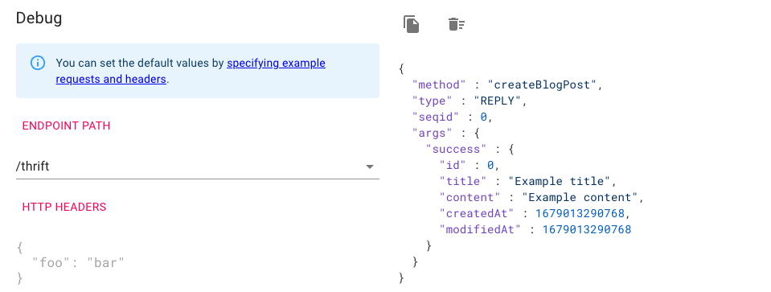

# Implementing DELETE operation

So far, we created, read, and updated a blog post.
Now, let's implement and make a call to finally delete a blog post.

<TutorialSteps current={7} />

## What you need

You need to have the files obtained from previous steps:

- [Java code generated](/tutorials/thrift/blog/define-service#compile-the-thrift-file)
- blog.thrift(both server and client)
- Main.java
- BlogService.java
- BlogClient.java
- BlogServiceExceptionHandler.java

## 1. Implement server-side

Let's implement a service method to delete a blog post.

Add a service method in the `BlogServiceImpl` class to delete a blog post.
  ```java filename=BlogServiceImpl.java
  import example.armeria.blog.thrift.DeleteBlogPostRequest;

  public class BlogServiceImpl implements BlogService.AsyncIface {
    ...
    @Override
    public void deleteBlogPost(DeleteBlogPostRequest request, AsyncMethodCallback<Void> resultHandler)
            throws TException {
        final BlogPost removed = blogPosts.remove(request.getId());
        if (removed == null) {
            resultHandler.onError(
                    new IllegalArgumentException("The blog post does not exist. ID: " + request.getId()));
        } else {
            resultHandler.onComplete(null);
        }
    }
  }
  ```

## 2. Implement client-side

Add a method `deleteBlogPost()` to send a request to delete a blog post.

In the `BlogClient` class, add a method sending a request to delete a blog post.

```java filename=BlogClient.java
import example.armeria.blog.thrift.DeleteBlogPostRequest;

public class BlogClient {
  ...
  void deleteBlogPost(int id) throws Exception {
      final DeleteBlogPostRequest request = new DeleteBlogPostRequest().setId(id);
      client.deleteBlogPost(request);
  }
}
```

## 3. Test deleting a blog post

Let's test deleting a blog post.

1. Call the `deleteBlogPost()` method to delete the first blog post with the ID `0`, followed by the `listBlogPosts()` method to see the first blog post no longer exists after deleting the post.
  ```java filename=BlogClient.java
  void testRun() throws Exception {
      createBlogPost("My first blog", "Yay");
      createBlogPost("Another blog post", "Creating a post via createBlogPost().");
      deleteBlogPost(0);
      listBlogPosts();
  }
  ```
2. [Re-run the server](/tutorials/thrift/blog/create-server#7-test-run) and run the client.

    If you search for `method=deleteBlogPost` from the logs, you can check if the `deleteBlogPost()` method is called like the following.
    ```
    [armeria-common-worker-nio-2-2] DEBUG c.l.a.c.logging.LoggingRpcClient - ... { ... , content=DefaultRpcRequest{
        serviceType=BlogService$Iface,
        serviceName=example.armeria.blog.thrift.BlogService$Iface,
        method=deleteBlogPost,
        params=[DeleteBlogPostRequest(id:0)]}}
    ```
    If you search for `ListBlogPostsResponse` from the subsequent logs, you can check that the list of posts retrieved starts from `1`, which is the second post.
   ```bash
   [armeria-common-worker-nio-2-2] DEBUG c.l.a.c.logging.LoggingRpcClient - ... { ... , content=CompletableRpcResponse{
    ListBlogPostsResponse(
      blogs:[BlogPost(
        id:1, title:Another blog post, content:Creating a post via createBlogPost()., createdAt:1677145864108, modifiedAt:1677145864108)])}}
   ```
4. Now, run the client again, while keeping the server running.

   You should see the exception logged as the following.
   This is because we attempted to delete the post with the ID `0`, which does not exist any longer.
   ```bash
   Exception in thread "main" BlogNotFoundException(reason:The blog post does not exist. ID: 0)
   ```

## 4. Add the Documentation service

This time, we'll add Armeria's [Documentation service](/docs/server-docservice).
Take advantage of the Documentation service which automatically creates documentation of your service methods, as well as providing means to test out the methods.

1. In the `newServer()` method, add a <type://DocService> and a request example for [creating blog posts](/tutorials/thrift/blog/implement-create),
  using <type://DocServiceBuilder#exampleRequests(Class,String,Iterable)>. Feel free to add more examples for other service methods.
  ```java filename=Main.java
  import com.linecorp.armeria.server.docs.DocService;
  import example.armeria.blog.thrift.CreateBlogPostRequest;

  public final class Main {
      private static Server newServer(int port) throws Exception {
          ...
          final CreateBlogPostRequest exampleRequest = new CreateBlogPostRequest()
                  .setTitle("Example title")
                  .setContent("Example content");
          final DocService docService = DocService
                  .builder()
                  .exampleRequests(List.of(new BlogService.createBlogPost_args(exampleRequest)))
                  .build();
          ...
      }
  }
  ```
2. In the `newServer()` method, add the <type://DocService> to our server builder.
  ```java filename=Main.java highlight=5
  private static Server newServer(int port) throws Exception {
      ...
      return Server.builder()
               .http(port)
               .service("/thrift", tHttpService)
               // You can access the documentation service at http://127.0.0.1:8080/docs.
               // See https://armeria.dev/docs/server-docservice for more information.
               .serviceUnder("/docs", docService)
               .build();
  }
  ```

3. (Optional) To access the Documentation service result easily, edit the log message in the `main()` method.
  ```java filename=Main.java highlight=2
  public static void main(String[] args) throws Exception {
      ...
      logger.info("Server has been started. Serving DocService at http://127.0.0.1:{}/docs",
                  server.activeLocalPort());
  }
  ```
4. Now, [re-run the server](/tutorials/thrift/blog/run-server-and-client#2-run-the-server).
  The server and services are launched successfully if you see this message.
  ```bash
   Server has been started. Serving DocService at http://127.0.0.1:8080/docs
  ```

## 5. Check the DocService page

Let's test and call our service operations using Armeria's Documentation service.

1. Click the URL `http://127.0.0.1:8080/docs` from the log message or open up the URL on a web browser. If you see the Document service page, you've successfully launched the <type://DocService> and server.

  

2. Click the **CreateBlogPost()** method link in the left panel. You can make calls to the method from the page.

  

  Note that in the **REQUEST BODY** section the values specified in the `exampleRequest` are automatically displayed on the page.

  ```java filename=Main.java
  final CreateBlogPostRequest exampleRequest = new CreateBlogPostRequest()
          .setTitle("Example title")
          .setContent("Example content");
  ```

3. Click the **SUBMIT** button, and you'll see the blog post information returned in the right panel.

  

## What's next

Here, we've implemented a service method and client method for deleting a blog post.
Next, we'll finally [add](/tutorials/thrift/blog/add-docservice) Armeria's [Documentation service](/docs/server-docservice) to our service.

<TutorialSteps current={7} />
