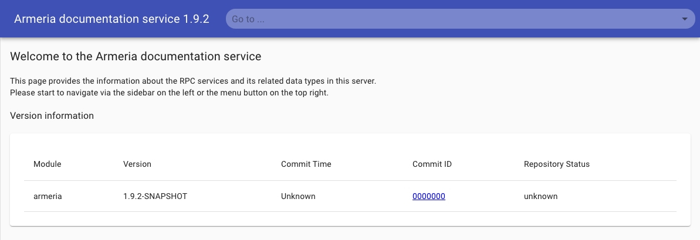
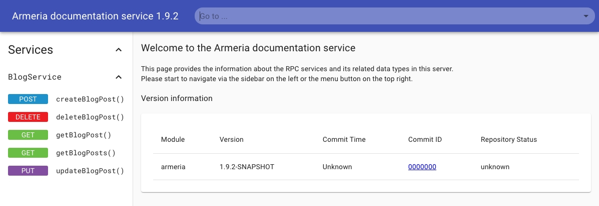
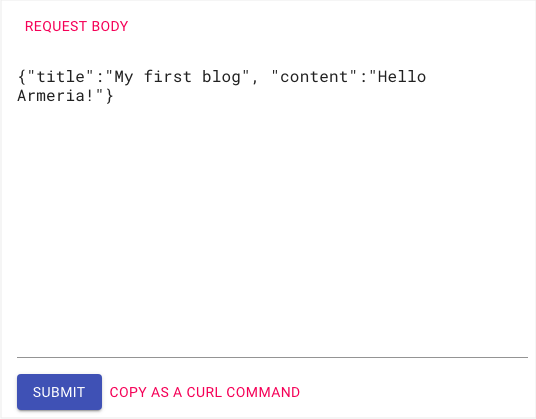
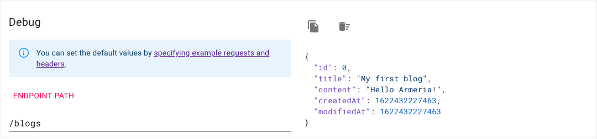

# Adding services to a server

In this step, we'll add an empty blog service to the server we created in [Step 1. Create a server](/tutorials/tutorial-blog-rest-create-server). Also, we'll add Armeria's [Documentation service](/docs/server-docservice) for testing our blog service.

<TutorialSteps current={3} />

## What you need

No preparation is required for this step.

## 1. Create a service file

Create a service file, BlogService.java. You can see the full version of the file [here](https://github.com/line/armeria-examples/blob/master/tutorials/rest-api-annotated-service/src/main/java/example/armeria/server/blog/BlogService.java). We'll add on service methods in this class in later steps.

```java filename=BlogService.java
package example.armeria.server.blog;

import java.util.Map;
import java.util.concurrent.ConcurrentHashMap;

public final class BlogService {
  private final Map<Integer, BlogPost> blogPosts = new ConcurrentHashMap<>();
}
```

## 2. Add a blog service to server

In [Step 1. Create a server](/tutorials/tutorial-blog-rest-create-server), we added a dummy service just to check that a server is launched. Now, let's remove the dummy service and add an empty blog service, instead.

1. From Main.java, remove the dummy service at line 4.
  ```java filename=Main.java highlight=4 showlineno=true
  static Server newServer(int port) {
    ...
    return sb.http(port)
             .service("/", (ctx, req) -> HttpResponse.of("Hello, Armeria!")) // Remove this
             .build();
  ```
2. Add our service by adding line 4.
  ```java filename=Main.java highlight=4 showlineno=true
  static Server newServer(int port) {
    ...
    return sb.http(port)
             .annotatedService(new BlogService())   // Add this
             .build();
  }
  ```

## 3. Add the Documentation service

This time, we'll add Armeria's [Documentation service](/docs/server-docservice):

1. In the `newServer()` method, add a <type://DocService> and a request example for [creating blog posts](/tutorials/tutorial-blog-rest-create), 
   using <type://DocService.exampleRequests>. Feel free to add more examples for other service methods.

  ```java filename=Main.java highlight=1,6-13
  import com.linecorp.armeria.server.docs.DocService;

  public final class Main {
    static Server newServer(int port) {
      ServerBuilder sb = Server.builder();
      DocService docService =
              DocService.builder()
                        .exampleRequests(BlogService.class,
                            "createBlogPost", // Name of service method
                            "{\"title\":\"My first blog\", \"content\":\"Hello Armeria!\"}")
                        .build();
  ```

2. Inside the `newServer()` method, add the <type://DocService> to our server builder.

  ```java filename=Main.java highlight=5
  static Server newServer(int port) {
    ...
    return sb.http(port)
             .annotatedService(new BlogService())
             .serviceUnder("/docs", docService)  // Add Documentation service
             .build();
  }
  ```

3. (Optional) To access the Documentation service result easily, edit the log message we added in [Step 1. Create a server](/tutorials/tutorial-blog-rest-create-server) to the one specified below.

  ```java filename=Main.java highlight=2
  public static void main(String[] args) throws Exception {
      logger.info("Server has been started. Serving DocService at http://127.0.0.1:{}/docs",
                server.activeLocalPort());
  }
  ```

## 4. Run the server and services

Like we did in _Step 1. Create a server_, [build and run](/tutorials/tutorial-blog-rest-create-server#3-run-the-server-and-service) the service by running the `main()` method or using Gradle.

The server and services are launched successfully if you see this message.

```bash
 Server has been started. Serving DocService at http://127.0.0.1:8080/docs
```

## 5. Check DocService page

Let's test and call our service operations, using Armeria's Documentation service.

Click the URL `http://127.0.0.1:8080/docs` from the log message or open the URL on a web browser. If you see the Document service page, you've launched the <type://DocService> and server successfully. We're seeing no services on the 
page because we're to implement service methods.

  

### Using DocService after adding service methods

When you add service methods through later steps, you'll see a result similar to this.



To test your service methods with the [Documentation service](/docs/server-docservice):

1. Click the **createBlogPost()** method link in the left panel. You can make calls to the creation method from the page opened.

  

  Note that in the **REQUEST BODY** section that the values specified for the <type://DocServiceBuilder> are automatically entered on the page.

  ```java filename=Main.java highlight=5-8
  static Server newServer(int port) {
    ServerBuilder sb = Server.builder();
    DocService docService =
      DocService.builder()
                .exampleRequests(
                  BlogService.class,
                  "createBlogPost",
                  "{\"title\":\"My first blog\",\"content\":\"Hello Armeria!\"}")
                .build();
  ```

2. Click the **SUBMIT** button, and you'll see the blog post information returned in the right panel.

  

## What's next?

In this step, we've added an empty blog service and the Documentation service to a server.

Next, at [Step 4. Implement CREATE](/tutorials/tutorial-blog-rest-create), we'll finally implement a CREATE 
operation to create blog posts.

<TutorialSteps current={3} />
