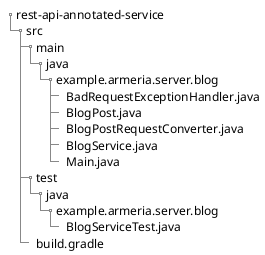

# REST tutorial introduction

In this tutorial, you will learn to build a RESTful service with Armeria.
Using Armeria's annotations you can build RESTful services on the go.
Armeria features you will use in this tutorial are:

- [Service annotations](/docs/server-annotated-service)
- [Request converter](/docs/server-annotated-service#injecting-value-of-parameters-and-http-headers-into-a-java-object)
- Response converter
- Exception handler
- Blocking

The [sample service provided](#) is a minimal blog service with which you can create, read, update and delete blog posts.
To keep our focus on Armeria, this tutorial and the sample service does not contain database operations.
Instead, memory-based data operation is used.

[Try building a service](#run-blog-service) by following the tutorial or have a go at [running the sample service](#try-building-blog-service-yourself) right away.

## Assumptions

This tutorial assumes that you have:

- Experience in building services in Java
- Used other Java frameworks for server-side programming
- An understanding of RESTful APIs and how to implement them

## Prerequisites

To run and develop the sample service yourself, install the following requirements on your computer:

- JDK 14
- Gradle
  - Set your Gradle to compile Java with the `-parameters` option

## Sample service

The sample blog service provides you implementations of CRUD operations.

| Operation | Method | Annotation | 
| -- | -- | -- |
| Create | `createBlogPost()` | `@Post` |
| Read | `getBlogPost()`, `getBlogPosts()` | `@Get` |
| Update | `updateBlogPost()` | `@Put` |
| Delete | `deleteBlogPost()` | `@Delete` |

### Sample service structure

The [sample service code](#) consists of the following folders and files.

## Run sample service

Have a go at running the sample service to see the result of this tutorial. Using Armeria's Doc service, you can see a server running, receiving requests and providing responses.

1. Download the code from [here](#).
2. Build and run the sample service.
3. Open TBU on your web browser. //TODO: decide whether to

## Try writing blog service yourself

Try writing the blog service yourself by following the instructions:

- [Step 1. Create a server](#)
- [Step 2. Write](#)
- [Step 3. TBU](#)
- [Step 4. TBU](#)