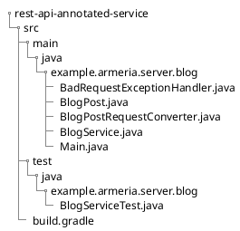

# REST tutorial introduction

Using Armeria's annotations, you can build RESTful services on the go.
Through this tutorial, you will learn to build a RESTful service with Armeria.
In particular, you will be using these Armeria features:

- [Service annotations](/docs/server-annotated-service)
- [Request converter](/docs/server-annotated-service#injecting-value-of-parameters-and-http-headers-into-a-java-object)
- [Exception handler](/docs/server-annotated-service#handling-exceptions)
- [Blocking](/docs/server-annotated-service/#specifying-a-blocking-task-executor)

This tutorial is based on a [sample service](https://github.com/line/armeria-examples/tree/master/rest-api-annotated-service), a minimal blog service, with which you can create, read, update, and delete blog posts.
To keep our focus on Armeria, this tutorial and the sample service use memory-based operations instead of database operations.

[Try writing a service yourself](#try-writing-blog-service-yourself) by following this tutorial or have a go at [running the sample service](#run-sample-service) right away.

## Assumptions

This tutorial assumes that you have:

- Experiences in building services in Java
- Experiences in Java frameworks for server-side programming
- Understanding of RESTful APIs and how to implement them

## Prerequisites

To run and develop the sample service, prepare the following requirements on your computer:

- JDK 8 or higher
- Gradle
  - Set your Gradle to compile Java with the [-parameters](../docs/setup/#configure--parameters-javac-option) option

## Sample service

The sample service provides you implementations of CRUD operations as specified below.

| Operation | Method | Annotation |
| -- | -- | -- |
| Create | `createBlogPost()` | `@Post` |
| Read | `getBlogPost()`, `getBlogPosts()` | `@Get` |
| Update | `updateBlogPost()` | `@Put` |
| Delete | `deleteBlogPost()` | `@Delete` |

### Sample service structure

The [sample service code](https://github.com/line/armeria-examples/tree/master/rest-api-annotated-service) consists of the following folders and files.



## Run sample service

Have a go at running the sample service and experience the outcome of this tutorial.
Using Armeria's Doc service, you can see a server running, receiving requests and providing responses.

1. Download the code from [here](https://github.com/line/armeria-examples/tree/master/rest-api-annotated-service).
2. Build the sample service using the Gradle Wrapper.
  ```bash
  $ ./gradlew build
  ```
3. Run the sample service again, using the Gradle Wrapper.
  ```bash
  $ ./gradlew run
  ```
4. Open the Doc service on your web browser at http://127.0.0.1:8080/docs.

## Try writing blog service yourself

Try writing the blog service yourself by following the guides in the given order:

1. [Creating a server](./tutorial-blog-rest-step1)
2. [Preparing a data object](./tutorial-blog-rest-step2)
3. [Implementing CREATE operation](./tutorial-blog-rest-step3)
4. [Implementing READ operation](./tutorial-blog-rest-step4)
5. [Implementing UPDATE operation](./tutorial-blog-rest-step5)
6. [Implementing DELETE operation](./tutorial-blog-rest-step6)
7. [Adding services to server](./tutorial-blog-rest-step7)