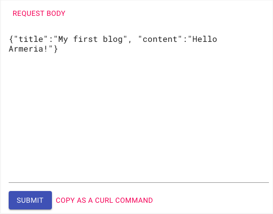

# Add blog service and DocService to server

In this step, we go back to the [Step 1. Create a server](./tutorial-blog-rest-step1) and add the blog service to the server. Also, we'll add Armeria's [DocService](/docs/server-docservice) to test our blog service.

<TutorialSteps current={7} />

## What you need

You need to have these files obtained from previous steps.

- BadRequestExceptionHandler.java
- BlogPost.java
- BlogPostRequestConverter.java
- BlogService.java
- Main.java

## 1. Add blog service

In [Step 1. Create a server](./tutorial-blog-rest-step1), you've added a dummy service just to check that a server is launched. Now, let's remove the dummy service and add our blog service.

1. From Main.java, remove the dummy service by removing lines 4 and 5.
  ```java filename=Main.java highlight=4,5
  static Server newServer(int port) {
    ...
    return sb.http(port)
              .service("/",(ctx, req) ->              // remove
                  HttpResponse.of("Hello, Armeria!")) // remove
              .build();
  ```
2. Add our service by adding line 4.
  ```java filename=Main.java highlight=4
  static Server newServer(int port) {
    ...
    return sb.http(port)
              .annotatedService(new BlogService())   // add this
              .build();
  }
  ```

## 2. Add DocService

Let's test and call our service operations, using Armeria's <type://DocService>.

1. Inside the `newServer()` method, add the <type://DocService> to our server builder.
  ```java filename=Main.java highlight=5
  static Server newServer(int port) {
    ...
    return sb.http(port)
            .annotatedService(new BlogService())
            .serviceUnder("/docs", docService)  // Add doc service
            .build();
  }
  ```
2. Again, in the `newServer()` method, build a <type://DocService>, and add a request example for creating blog posts, using <type://DocService.exampleRequests>. Feel free to add more examples for other service methods.
  ```java filename=Main.java highlight=3-9
  static Server newServer(int port) {
    final ServerBuilder sb = Server.builder();
    final DocService docService =
            DocService.builder()
                      .exampleRequests(BlogService.class,
                                        "createBlogPost", // service method name
                                        "{\"title\":\"My first blog\", \"content\":\"Hello Armeria!\"}")
                      .build();
  ```
3. (Optional) To access the <type://DocService> result easily, edit the log message we added in [Step 1. Create a server](./tutorial-blog-rest-step1) to the one specified below.
  ```java filename=Main.java highlight=2
  public static void main(String[] args) throws Exception {
      logger.info("Server has been started. Serving DocService at http://127.0.0.1:{}/docs",
                server.activeLocalPort());
  }
  ```

## 3. Run the server and service

Like we did in [Step 1. Create a server](/tutorial-blog-rest-step1#4-run-the-server-and-service), build and run the service by running the `main()` or using Gradle.

The server and services are launched successfully if you see this message.

```bash
 Server has been started. Serving DocService at http://127.0.0.1:8080/docs
```

## 4. Check DocService pages

Let's add Armeria's <type://DocService> to our blog service:

1. Click the URL `http://127.0.0.1:8080/docs` from the log message or open the URL on a web browser. If you see the <type://DocService> page, you've launched the services and server successfully.
  
2. Click the `createBlogPost()` method from the left panel. You can make calls to the creation method from this page.

  

  Note that in the **REQUEST BODY** section that the values specified for the <type://DocServiceBuilder> are automatically entered on the page.
  ```java filename=Main.java highlight=5-8
  static Server newServer(int port) {
    final ServerBuilder sb = Server.builder();
    final DocService docService =
            DocService.builder()
              .exampleRequests(
                BlogService.class,
                "createBlogPost",
                "{\"title\":\"My first blog\",\"content\":\"Hello Armeria!\"}")
              .build();
  ```
3. Click the **SUBMIT** button, and you'll see the blog post information returned in the right panel.

  