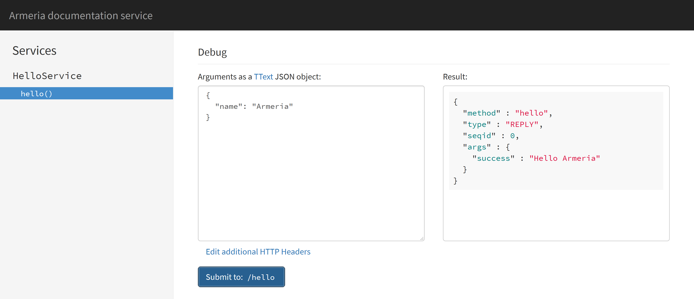
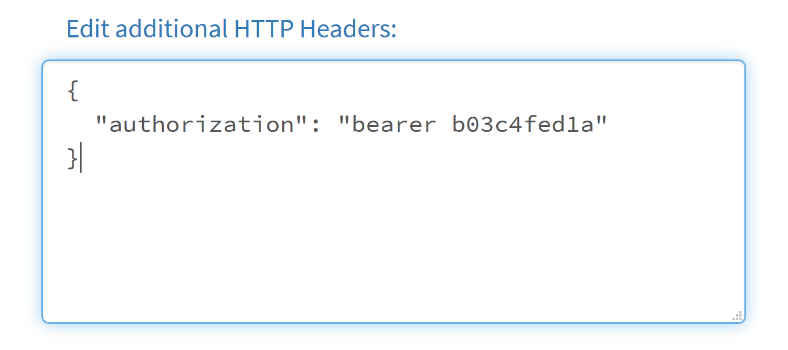

.. _server-docservice:

Browsing and invoking services with ``DocService``
==================================================

:api:`DocService` is a single-page web application which provides the following useful features:

- Browsing the list of gRPC, Thrift or annotated services and their operations available in the server
- Invoking a service operation from a web form
- Creating a permalink for the invocation you've made

First, add :api:`DocService` to the :api:`ServerBuilder`:

.. code-block:: java

    import com.linecorp.armeria.common.grpc.GrpcSerializationFormats;
    import com.linecorp.armeria.server.docs.DocService;
    import com.linecorp.armeria.server.grpc.GrpcServiceBuilder;
    import com.linecorp.armeria.server.ServerBuilder;
    import com.linecorp.armeria.server.thrift.THttpService;

    ServerBuilder sb = new ServerBuilder();
    sb.http(8080);

    // Add a Thrift service which implements 'ThriftHelloService'.
    sb.service("/hello", THttpService.of(new MyThriftHelloService()));

    // Add a gRPC service which implements 'GrpcHelloService'.
    // Unlike Thrift, you must enable gRPC-Web and unframed requests explicitly.
    sb.service(new GrpcServiceBuilder().addService(new MyGrpcHelloService())
                                       .supportedSerializationFormats(
                                               GrpcSerializationFormats.values())
                                       .enableUnframedRequests(true)
                                       .build());

    // Add an annotated HTTP service.
    sb.annotatedService("/service", new MyAnnotatedService());

    // Add a DocService which scans all Thrift and gRPC services added to the server.
    sb.serviceUnder("/docs", new DocService());

    Server server = sb.build();
    server.start().join();

.. note::

    :api:`DocService` will scan for all supported services automatically when the :api:`Server` starts up.
    Please see :ref:`inclusion-rule` to learn how to include or exclude certain services.

Open http://127.0.0.1:8080/docs/ in your web browser and you'll see the following screen:

.. image:: _images/docservice_1.png

The left pane of the screen shows the list of the available services and their operations. If you defined
structs, enums or exceptions, they will appear there as well. If you click the ``hello()`` operation, the
right pane will show the details of the operation such as the list of the parameters, the return type and
the exceptions which may be thrown:

.. image:: _images/docservice_2.png

As you may have noticed, the 'description' column is empty. :api:`DocService` can even show the docstrings
you put into your ``.thrift`` or ``.proto`` files with a little bit of build configuration. We will visit this
later in this document.

Debug form
----------

Now, scroll down the right pane. You'll find a 'debug form' which enables you to send an RPC request in
human-friendly JSON format:

.. image:: _images/docservice_3.png

Type the request parameters like the following and click the 'Submit to: /hello' button:

.. code-block:: json

    {
      "name": "Armeria"
    }

The result pane right next to the text area you entered the JSON request will show the reply in JSON:

The current location of your web browser should be updated like the following:

- ``http://127.0.0.1:8080/docs/#!method/com.example.ThriftHelloService/hello?args=%7B%22name%22%3A%22Armeria%22%7D``

Imagine you build a request that reproduces the problem using the debug form and share the URL of the request
with your colleagues. It's way more convenient than traditional workflow for replaying an RPC request.

Sending HTTP headers
^^^^^^^^^^^^^^^^^^^^

You may want to send an additional HTTP header such as ``authorization`` when sending an RPC request via
a debug form. Click the 'Edit additional HTTP headers' link below the text area, and you'll see another
text area which allows you to specify the HTTP headers you want to add:

.. _inclusion-rule:

Including and excluding service methods
---------------------------------------

You can include or exclude service methods using :api:`DocServiceFilter` when building a :api:`DocService`
with a :api:`DocServiceBuilder`:

.. code-block:: java

    import com.linecorp.armeria.server.docs.DocServiceBuilder;
    import com.linecorp.armeria.server.docs.DocServiceFilter;

    ServerBuilder sb = new ServerBuilder();
    ...
    sb.serviceUnder("/docs", new DocServiceBuilder()
            // Include Thrift services and Annotated services.
            .include(DocServiceFilter.ofThrift().or(DocServiceFilter.ofAnnotated()))
            // Exclude the method whose name is "foo" in Thrift services.
            .exclude(DocServiceFilter.ofThrift().and(DocServiceFilter.ofMethodName("foo")))
            .build());
    ...

The inclusion rule is as follows:

- No ``include(DocServiceFilter)`` and ``exclude(DocServiceFilter)`` is called: include all methods.
- Only ``exclude(DocServiceFilter)`` is called: include all methods except the methods which the exclusion filter returns ``true``.
- Only ``include(DocServiceFilter)`` is called: include the methods which the inclusion filter returns ``true``.
- ``include(DocServiceFilter)`` and ``exclude(DocServiceFilter)`` is called: include the methods which the inclusion filter returns ``true`` and the exclusion filter returns ``false``.

Example requests and headers
----------------------------

You can specify the example requests and HTTP headers which will be used as the default value of the debug form
with a :api:`DocServiceBuilder`:

.. code-block:: java

    import com.linecorp.armeria.common.HttpHeaders;
    import static com.linecorp.armeria.common.HttpHeaderNames.AUTHORIZATION;

    ServerBuilder sb = new ServerBuilder();
    ...
    sb.serviceUnder("/docs", new DocServiceBuilder()
            // HTTP headers for all services
            .exampleHttpHeaders(HttpHeaders.of(AUTHORIZATION, "bearer b03c4fed1a"))
            // Thrift example request for 'ThriftHelloService.hello()'
            .exampleRequest(new ThriftHelloService.hello_args("Armeria"))
            // gRPC example request for 'GrpcHelloService.Hello()'
            .exampleRequestForMethod(GrpcHelloServiceGrpc.SERVICE_NAME,
                                     "Hello", // Method name
                                     HelloRequest.newBuilder().setName("Armeria").build())
            .build());
    ...

By adding examples to :api:`DocService`, your users will be able to play with the services you wrote
without a hassle and thus will understand them sooner and better.

Adding docstrings
-----------------

Configure your build script so that it generates the required metadata file for your ``.thrift`` or ``.proto``
files into the specific location in the class path.

For Thrift:

- Use the ``--gen json`` option to generate the ``.json`` file that contains the docstrings.
- Put the generated ``.json`` file into the ``META-INF/armeria/thrift`` directory.

For gRPC:

- Configure the protobuf plugin to generate the ``.dsc`` file that contains the docstrings and
  put it into the ``META-INF/armeria/grpc`` directory:

  .. code-block:: java

      protobuf {
          generateProtoTasks {
              all().each { task ->
                  task.generateDescriptorSet = true
                  task.descriptorSetOptions.includeSourceInfo = true
                  task.descriptorSetOptions.includeImports = true
                  task.descriptorSetOptions.path =
                          "${buildDir}/resources/main/META-INF/armeria/grpc/service-name.dsc"
              }
          }
      }
