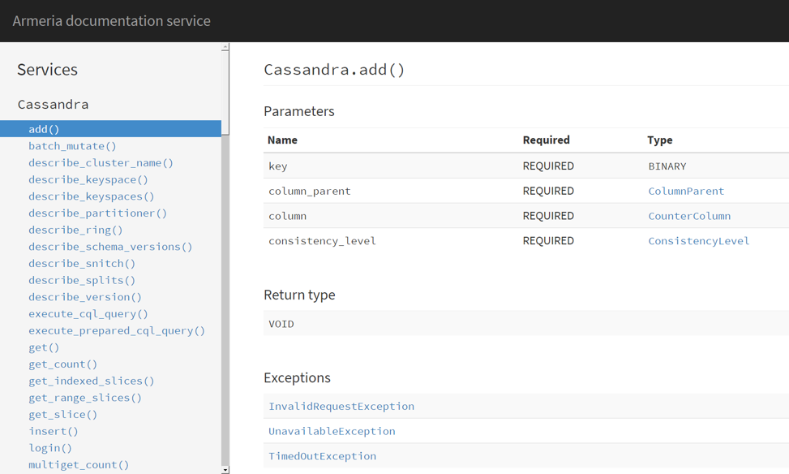

.. _`Swagger`: http://petstore.swagger.io/
.. _`Client basics`: client-basics.html
.. _`Serving static files`: server-http-file.html
.. _`Embedding Apache Tomcat`: server-http-tomcat.html
.. _`ServerBuilder`: apidocs/index.html?com/linecorp/armeria/server/ServerBuilder.html
.. _`Service`: apidocs/index.html?com/linecorp/armeria/server/Service.html

Server basics
=============

Let's assume we have the following Thrift IDL:

.. code-block:: thrift

    namespace java com.example.thrift

    service HelloService {
        string hello(1:string name)
    }

The Apache Thrift compiler will produce some Java code under the ``com.example.thrift`` package. The most
noteworthy one is ``HelloService.java`` which defines the service interfaces we will implement:

.. code-block:: java

    public class HelloService {
        public interface Iface {
            public String hello(String name) throws TException;
        }

        public interface AsyncIface {
            public void hello(String name, AsyncMethodCallback resultHandler) throws TException;
        }
        ...
    }

If you are interested in going fully asynchronous, it is recommended to implement the ``AsyncIface`` interface,
while it is slightly easier to implement the synchronous ``Iface`` interface:

.. code-block:: java

    public class MyHelloService implements HelloService.AsyncIface {
        @Override
        public void hello(String name, AsyncMethodCallback resultHandler) throws TException {
            resultHandler.onComplete("Hello, " + name + '!');
        }
    }

    // or synchronously:
    public class MyHelloService implements HelloService.Iface {
        @Override
        public String hello(String name) throws TException {
            return "Hello, " + name + '!';
        }
    }

Bootstraping an Armeria server
------------------------------
You can configure an Armeria server using the fluent builder pattern, as shown below:

.. code-block:: java

    HelloService.AsyncIface helloHandler = new MyHelloService();

    ServerBuilder sb = new ServerBuilder();
    sb.port(8080, SessionProtocol.HTTP);
    sb.serviceAt(
            "/hello",
            ThriftService.of(helloHandler, SerializationFormat.THRIFT_BINARY)
                    .decorate(LoggingService::new)).build();

    Server server= sb.build();
    server.start();

In the example above, we created a new ``ServerBuilder`` and added a new ``ThriftService`` to it.
The ``ThriftService`` is bound at the path ``/hello`` and will use the TBinary format.

We also decorated the ``ThriftService`` using ``LoggingService``, which logs all Thrift calls and replies.
You might be interested in decorating a service using other decorators, to gather metrics for example.

Note that you can add more than one ``ThriftService`` (or any ``Service`` implementation) to a ``Server``.

Adding a documentation service
------------------------------
As usual, we could browse a Thrift IDL in a text editor to see the list of the available structs and
services. However, most of us will admit that it will be much nicer if we could browse such information
like we do for RESTful services via `Swagger`_.

Armeria provides a service called ``DocService``, which discovers all ``ThriftService`` in your Armeria server
and lets you browse the available service operations and structs:

.. code-block:: java

    ServerBuilder sb = new ServerBuilder();
    sb.serviceAt("/foo/", ThriftService.of(...))
      .serviceAt("/bar/", ThriftService.of(...))
      .serviceUnder("/docs/", new DocService());

Note that we used ``serviceUnder()`` for ``DocService`` unlike the other services. ``serviceUnder()`` binds
a service to a directory recursively (prefix match) while ``serviceAt()`` binds to a specific path only
(exact-match.)

If you open ``http://127.0.0.1:8080/docs/`` in your browser, you will see the documentation pages produced by
the ``DocService``. Here's a sample, generated from the Cassandra Thrift IDL:

Next steps
----------

- `Client basics`_ if you want to make a Thrift call to your Armeria server
- `Serving static files`_ if you want to serve static files in your Armeria server
- `Embedding Apache Tomcat`_ if you want to run your JEE web application on the same port
- or you could explore the server-side API documentation:
   - `ServerBuilder`_
   - `Service`_
