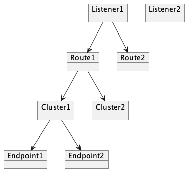
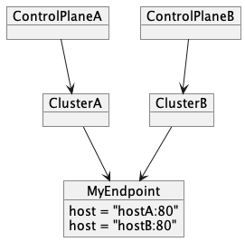

xDS Integration
----

## Abstract

This document describes the design of Armeria's `XdsBootstrap`, which is the
main point for xDS operations. The intention is to document the initial design
of this component, rather than to restrain how the API should be evolved.

## Background

We have received many requests for more dynamic control over Armeria components.
An example of such a use-case was to dynamically modify `RetryingClient` or
`CircuitBreakerClient` behavior. Another often sought feature
has been finer Service Discovery, where users would like to dynamically route requests
depending on parameters. For seamless integration with other ecosystems, it has been
proposed that the xDS protocol be implemented.

In order to integrate xDS with Armeria components, it is important to first fetch and parse
remote xDS resources. This document introduces a `XdsBootstrap` which is responsible for doing so.

## Implementation

### Terminology

- **Subscribe**: Refers to opening a connection to a remote control plane server for a resource.
- **Watch**: Refers to registering a callback for a resource of interest.
- **Resource**: The xDS resources (`Listener`, `Cluster`, ...).
  - For the purposes of this document, `Endpoint` and `Route` are used instead of the xDS resource names
    (i.e. `ClusterLoadAssignment`, `RouteConfiguration`) for brevity.
- **ConfigSource**: Configuration of how xDS resources are fetched.
- **Stream**: Represents a persistent gRPC stream to a control plane server.

### The XdsBootstrap API

The `XdsBootstrap` is the entry point which stores an xDS `Bootstrap`, and retrieves xDS resources.
A `Bootstrap` contains information about where to initially fetch resources from. 
New watches will use the control plane server specified.

Conceptually, a `xDSClient` can perform two operations:
- Subscribe to a resource.
- Watch a resource.

Subscribing to a resource signifies that the `XdsBootstrap` will start subscribing to a remote
control plane for the requested resource. If the resource is not watched before, this
may involve creating a new connection with the remote control plane to fetch remote data.
It is important that subscriptions are closed so that `XdsBootstrap` doesn't leak resources.

Watching a resource means registering a callback to the `XdsBootstrap`. Once a `XdsBootstrap`
receives a resource, it will notify the registered watchers of the event.

The above operations are distinct because users may not necessarily want to always
subscribe to a resource. For instance users may want to query a resource defined
in the `Bootstrap`'s `static_resources` section.

To prove by contradiction, assume that only a single `XdsBootstrap.watch` API were defined.
If we are interested in watching a cluster and its endpoints, we can write the following:
```
XdsBootstrap.watch(CLUSTER, "my-cluster", clusterWatcher);
XdsBootstrap.watch(ENDPOINT, "my-cluster", endpointWatcher);
```

For the first call to `CLUSTER`, we would like to query the remote control plane and fetch the
remote resources. However, for the second call to `ENDPOINT` we probably wouldn't like to open
a new connection since it is obvious that `ENDPOINT` is obviously fetched as a result of the first call.
Even if we do query for the endpoint, there is no guarantee that the endpoint
exists since it might not be queryable as an EDS.

All watch callbacks are guaranteed to be invoked from a single event loop.

### Resources

Although xDS defines many different types of resources, only the basic
`Listener`, `Route`, `Cluster`, `Endpoint` will be supported. Because `XdsBootstrap`
is not aware of which features it would like to support, it will 

### ConfigSource

`ConfigSource` contains information on where a resource may be fetched from.
The `Bootstrap` contains `ConfigSource`s which are used when `XdsBootstrap.subscribe`
is called. 

Additionally, each subscribed resource may contain a config source. For instance,
a `Cluster` may contain an EDS `ConfigSource`. For this reason, a `ConfigSource`
may also be supplied when subscribing to a resource.

`XdsBootstrap` must maintain connections to different remote control planes depending
on the `ConfigSource`. To avoid opening a connection for every `XdsBootstrap.subscribe` call,
a map of `ConfigSource` to clients (called `ConfigSourceClient`) is maintained.
Once `XdsBootstrap.subscribe` is called, the appropriate `ConfigSourceClient` is fetched
and `ConfigSourceClient.subscribe` is called.

### XdsStream

Each `ConfigSourceClient` maintains a single persistent connection (or a `Stream`) to the remote
control plane server. Because a `Stream` can support different `XdsBootstrap.subscribe(type, resourceName)`
calls, a single `Stream` may subscribe to multiple xDS types and resources.
In order to represent the types and resources being subscribed, each `ConfigSourceClient` maintains
its own map of `Subscriber`s. Conceptually, each `(type, resource)` is mapped to a `Subscriber`.

Once a `ConfigSourceClient` is subscribed to, a new `Stream` is created.
To the contrary, if a `Stream` is fully unsubscribed, a `Stream` is not necessary and is cleaned up.
Since it is possible that multiple subscribes to a same type and resource is called, each `Subscriber` holds
a reference count.

Whenever a subscribed resource is updated in the remote control plane server, a notification is
sent to the client over the `Stream`. The `Stream` then parses the resources and passes the
data to the `Subscriber`. Eventually, the subscriber will notify the subscribed `Watcher`s of this resource.

### Watchers

`Watcher`s can be registered via `XdsBootstrap.addClusterWatcher(type, resource, watcher)`.
The `XdsBootstrap` contains a `WatcherStorage` which stores these `Watcher`s.
The `WatcherStorage` contains a `(type, resource)` to `Watcher[]` map.

### Automatic Resource Fetching

Each xDS resource may contain a `ConfigSource` which indicates how to fetch another resource.
For instance, a `Cluster` may contain an `EDS` configuration indicating how `Endpoint`s should
be fetched.

The purpose of the `XdsBootstrap` is to fetch all remote resources and to allow other components
to query these resources. For this reason, it makes sense that if a fetched resource contains
a `ConfigSource`, the next resource is also fetched.

As an example, we can see that if a `Listener` is fetched the next resources are also fetched
in a tree-like structure. Because each `Resource` acts like a tree node conceptually, the stored
`Resource`s are named `ResourceNode`s. `Resource`s that watch other nodes are called `DynamicResource`s,
whereas `Resource`s that do not watch other nodes are called `StaticResource`s.



For this reason, each `Resource` may also invoke a new `XdsBootstrap.subscribe`. For this reason,
each `Resource` is also a potential `Watcher` and implements the `Watcher` interface.
For practical purposes, fetched `Resource`s are also stored in the `WatcherStorage`.
It is still possible that the tree happens to contain multiple `Resource`s with the same type and name.
For this reason, `WatcherStorage` contains a `(type, resource)` to `ResourceNode[]` map.
The `ResourceNode[]` is stored in order of insertion.

### Duplicate ResourceNodes

Once a `Stream` receives a `Resource`, the `Subscriber` stores the `Resource` into the `WatcherStorage`
as a `ResourceNode`. However, it is possible that multiple different `ResourceNode`s are registered
for the same `(type, resource)` in different control plane servers.

For instance, assume that `ControlPlaneA` contains `ClusterA` pointing to `MyEndpoint`, and `ControlPlaneB`
contains `ClusterB` pointing to `MyEndpoint`. Although the name of both endpoints are `MyEndpoint`,
the contents of the `Endpoint` may be different.



When an update occurs, listeners are notified of the `ResourceNode` that was stored the longest.
The rationale behind this decision was to avoid frequent updates to listeners.
Each time a `Resource` is updated, the `ResourceNode`s are looped over to find a non-null `Resource`.
In order to avoid potentially duplicate notifications for the same resource, a `CompositeWatcher`
caches the last notified value.

## Error Handling

`Stream` tries to notify the control plane server of any parsing errors.
This is so that the control plane implementation is not in the dark and can be notified of
failures. This is preferably done by sending a nack response instead of resetting the connection
as it requires less resources. When a response is first received, all validation is done to
decide whether a response should be acked or not. After validation, it is expected that the code path
downstream does not throw an exception. If an exception is thrown, the exception is logged.

For each resource, there are features that haven't been implemented yet.
The current implementation only validates on features that are partially supported, and ignores
features that aren't supported.For instance, currently `PathConfigSource` is not supported but
`ApiConfigSource` is supported. If a user tries to pass a `ConfigSource` with `PathConfigSource`
an error is returned. On the other hand, `Filter`s currently aren't implemented at all,
and thus are ignored.

## Future Works

- Many of the `Bootstrap` parameters which specify how to connect to the control plane server
  such as `path_config_source`, `tls`, etc. are not supported.
- Provide better visibility into fetched objects for easier debugging.
- The xDS V3 protobuf API is exposed directly to the user. This may cause unexpected behavior because
  protobuf objects are by default mutable.
- Provide a way to return a snapshot of an update. For instance, if a listener is updated a watcher
  could notify after all resources the listener fetched are aggregated. For instance if a `Cluster`
  is modified, then a callback could be invoked once the attached `Endpoint`s are also fetched completely.
